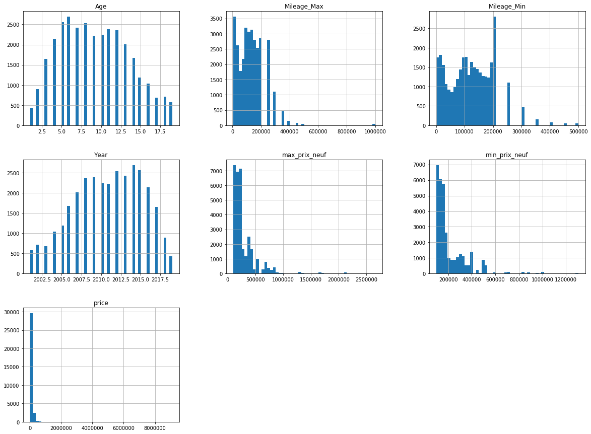
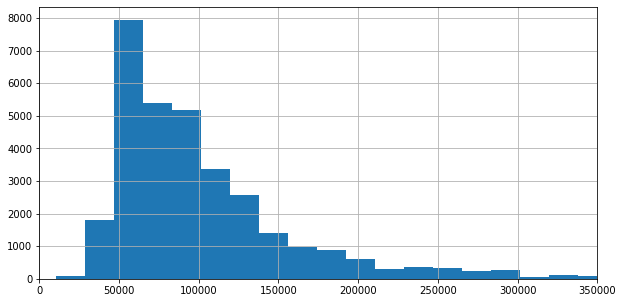
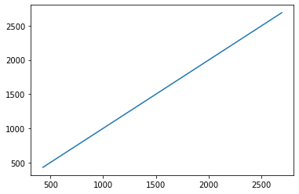
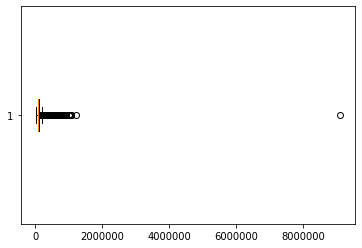
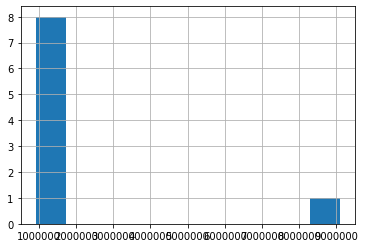
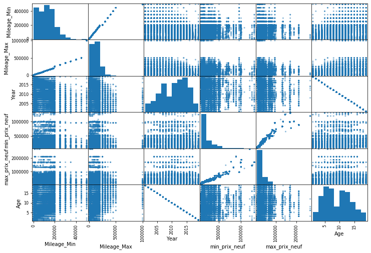
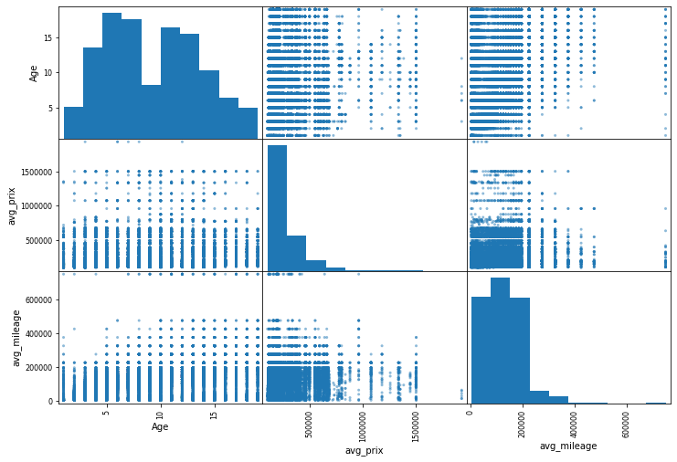
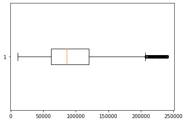

```python
###############################################################
###### Auther: Asiri Amal K                                 ###
###### Description : Car Price Prediction model in ML       ###
###############################################################
```


```python
#Imports
import pandas as pd
import numpy as np
from matplotlib import pyplot as plt
```


```python
car = pd.read_csv("DatasetADs.csv")
```

# Data Mining and Preprocessing


```python
car.describe()
```


<div>
<style scoped>
    .dataframe tbody tr th:only-of-type {
        vertical-align: middle;
    }

    .dataframe tbody tr th {
        vertical-align: top;
    }

    .dataframe thead th {
        text-align: right;
    }
</style>
<table border="1" class="dataframe">
  <thead>
    <tr style="text-align: right;">
      <th></th>
      <th>Mileage_Min</th>
      <th>Mileage_Max</th>
      <th>price</th>
      <th>Year</th>
      <th>min_prix_neuf</th>
      <th>max_prix_neuf</th>
      <th>Age</th>
    </tr>
  </thead>
  <tbody>
    <tr>
      <th>count</th>
      <td>32395.000000</td>
      <td>32395.000000</td>
      <td>3.239500e+04</td>
      <td>32395.000000</td>
      <td>3.239500e+04</td>
      <td>3.239500e+04</td>
      <td>32395.000000</td>
    </tr>
    <tr>
      <th>mean</th>
      <td>116592.066677</td>
      <td>131076.174070</td>
      <td>1.054981e+05</td>
      <td>2010.798796</td>
      <td>2.157886e+05</td>
      <td>2.907133e+05</td>
      <td>9.201204</td>
    </tr>
    <tr>
      <th>std</th>
      <td>75722.653802</td>
      <td>92740.841965</td>
      <td>8.690894e+04</td>
      <td>4.373741</td>
      <td>1.449547e+05</td>
      <td>2.233345e+05</td>
      <td>4.373741</td>
    </tr>
    <tr>
      <th>min</th>
      <td>0.000000</td>
      <td>4999.000000</td>
      <td>1.050000e+04</td>
      <td>2001.000000</td>
      <td>9.790000e+04</td>
      <td>9.990000e+04</td>
      <td>1.000000</td>
    </tr>
    <tr>
      <th>25%</th>
      <td>60000.000000</td>
      <td>64999.000000</td>
      <td>6.200000e+04</td>
      <td>2008.000000</td>
      <td>1.247000e+05</td>
      <td>1.711000e+05</td>
      <td>6.000000</td>
    </tr>
    <tr>
      <th>50%</th>
      <td>110000.000000</td>
      <td>119999.000000</td>
      <td>8.600000e+04</td>
      <td>2011.000000</td>
      <td>1.610000e+05</td>
      <td>2.199000e+05</td>
      <td>9.000000</td>
    </tr>
    <tr>
      <th>75%</th>
      <td>170000.000000</td>
      <td>179999.000000</td>
      <td>1.200000e+05</td>
      <td>2014.000000</td>
      <td>2.700000e+05</td>
      <td>3.589000e+05</td>
      <td>12.000000</td>
    </tr>
    <tr>
      <th>max</th>
      <td>500000.000000</td>
      <td>1000000.000000</td>
      <td>9.100000e+06</td>
      <td>2019.000000</td>
      <td>1.304000e+06</td>
      <td>2.660000e+06</td>
      <td>19.000000</td>
    </tr>
  </tbody>
</table>
</div>


```python
car.head()
```


<div>
<style scoped>
    .dataframe tbody tr th:only-of-type {
        vertical-align: middle;
    }

    .dataframe tbody tr th {
        vertical-align: top;
    }

    .dataframe thead th {
        text-align: right;
    }
</style>
<table border="1" class="dataframe">
  <thead>
    <tr style="text-align: right;">
      <th></th>
      <th>City</th>
      <th>Mileage_Min</th>
      <th>Mileage_Max</th>
      <th>price</th>
      <th>serie</th>
      <th>Make</th>
      <th>Date_ads</th>
      <th>Fuel</th>
      <th>Year</th>
      <th>Country_Make</th>
      <th>min_prix_neuf</th>
      <th>max_prix_neuf</th>
      <th>Age</th>
    </tr>
  </thead>
  <tbody>
    <tr>
      <th>0</th>
      <td>Casablanca</td>
      <td>35000</td>
      <td>39999</td>
      <td>295000</td>
      <td>GIULIA</td>
      <td>Alfa Romeo</td>
      <td>4/3/2019</td>
      <td>Diesel</td>
      <td>2017</td>
      <td>Italie</td>
      <td>369900</td>
      <td>494900</td>
      <td>3</td>
    </tr>
    <tr>
      <th>1</th>
      <td>Casablanca</td>
      <td>10000</td>
      <td>14999</td>
      <td>450000</td>
      <td>GIULIA</td>
      <td>Alfa Romeo</td>
      <td>7/7/2019</td>
      <td>Diesel</td>
      <td>2019</td>
      <td>Italie</td>
      <td>369900</td>
      <td>494900</td>
      <td>1</td>
    </tr>
    <tr>
      <th>2</th>
      <td>Mohammedia</td>
      <td>130000</td>
      <td>139999</td>
      <td>102000</td>
      <td>Giulietta</td>
      <td>Alfa Romeo</td>
      <td>7/27/2019</td>
      <td>Essence</td>
      <td>2010</td>
      <td>Italie</td>
      <td>229900</td>
      <td>279900</td>
      <td>10</td>
    </tr>
    <tr>
      <th>3</th>
      <td>Mohammedia</td>
      <td>130000</td>
      <td>139999</td>
      <td>102000</td>
      <td>Giulietta</td>
      <td>Alfa Romeo</td>
      <td>7/27/2019</td>
      <td>Essence</td>
      <td>2010</td>
      <td>Italie</td>
      <td>229900</td>
      <td>279900</td>
      <td>10</td>
    </tr>
    <tr>
      <th>4</th>
      <td>Casablanca</td>
      <td>200000</td>
      <td>249999</td>
      <td>100000</td>
      <td>Giulietta</td>
      <td>Alfa Romeo</td>
      <td>7/8/2019</td>
      <td>Diesel</td>
      <td>2011</td>
      <td>Italie</td>
      <td>229900</td>
      <td>279900</td>
      <td>9</td>
    </tr>
  </tbody>
</table>
</div>


## Dataset has 13 classes


```python
print(len(car.columns))
car.columns
```

    13
    


    Index(['City', 'Mileage_Min', 'Mileage_Max', 'price', 'serie', 'Make',
           'Date_ads', 'Fuel', 'Year', 'Country_Make', 'min_prix_neuf',
           'max_prix_neuf', 'Age'],
          dtype='object')


```python
car.dtypes
```


    City             object
    Mileage_Min       int64
    Mileage_Max       int64
    price             int64
    serie            object
    Make             object
    Date_ads         object
    Fuel             object
    Year              int64
    Country_Make     object
    min_prix_neuf     int64
    max_prix_neuf     int64
    Age               int64
    dtype: object


#### No missing values in the dataset


```python
car.isnull().sum()
```


    City             0
    Mileage_Min      0
    Mileage_Max      0
    price            0
    serie            0
    Make             0
    Date_ads         0
    Fuel             0
    Year             0
    Country_Make     0
    min_prix_neuf    0
    max_prix_neuf    0
    Age              0
    dtype: int64


## Categorical classes - 6
1. City
2. serie
3. Make
4. Date_ads
5. Fuel
6. Country_Make


```python
cat_classes = car.select_dtypes(include=object).columns
num_classes = car.select_dtypes(include=np.int64).columns
print(len(cat_classes))
print(cat_classes)
print(num_classes)

#Sample Categorical values
car.select_dtypes(include=object).head()
```

    6
    Index(['City', 'serie', 'Make', 'Date_ads', 'Fuel', 'Country_Make'], dtype='object')
    Index(['Mileage_Min', 'Mileage_Max', 'price', 'Year', 'min_prix_neuf',
           'max_prix_neuf', 'Age'],
          dtype='object')
    


<div>
<style scoped>
    .dataframe tbody tr th:only-of-type {
        vertical-align: middle;
    }

    .dataframe tbody tr th {
        vertical-align: top;
    }

    .dataframe thead th {
        text-align: right;
    }
</style>
<table border="1" class="dataframe">
  <thead>
    <tr style="text-align: right;">
      <th></th>
      <th>City</th>
      <th>serie</th>
      <th>Make</th>
      <th>Date_ads</th>
      <th>Fuel</th>
      <th>Country_Make</th>
    </tr>
  </thead>
  <tbody>
    <tr>
      <th>0</th>
      <td>Casablanca</td>
      <td>GIULIA</td>
      <td>Alfa Romeo</td>
      <td>4/3/2019</td>
      <td>Diesel</td>
      <td>Italie</td>
    </tr>
    <tr>
      <th>1</th>
      <td>Casablanca</td>
      <td>GIULIA</td>
      <td>Alfa Romeo</td>
      <td>7/7/2019</td>
      <td>Diesel</td>
      <td>Italie</td>
    </tr>
    <tr>
      <th>2</th>
      <td>Mohammedia</td>
      <td>Giulietta</td>
      <td>Alfa Romeo</td>
      <td>7/27/2019</td>
      <td>Essence</td>
      <td>Italie</td>
    </tr>
    <tr>
      <th>3</th>
      <td>Mohammedia</td>
      <td>Giulietta</td>
      <td>Alfa Romeo</td>
      <td>7/27/2019</td>
      <td>Essence</td>
      <td>Italie</td>
    </tr>
    <tr>
      <th>4</th>
      <td>Casablanca</td>
      <td>Giulietta</td>
      <td>Alfa Romeo</td>
      <td>7/8/2019</td>
      <td>Diesel</td>
      <td>Italie</td>
    </tr>
  </tbody>
</table>
</div>


##### CIty - Class

* There are 249 Cities in this category,
* Maximum number of vehicles can be found in 'Casablanca' and it is 10168
* The second one is 'Rabat' but it does have lesser than half of vehicles in 'Casablanca' and it is 3141

Class Category will not give valuable information for the machine learning predictions  because of the "Curse of Cardinality" (high dimentionality in feature space).


```python
print(car['City'].value_counts().shape)
car['City'].value_counts()
```

    (249,)
    


    Casablanca                 10168
    Rabat                       3141
    Marrakech                   2268
    Tanger                      2217
    Fès                         1666
    Agadir                      1657
    Salé                        1111
    Meknès                      1057
    Kénitra                     1000
    El Jadida                    673
    Tétouan                      670
    Mohammedia                   568
    Oujda                        489
    Temara                       416
    Safi                         366
    Béni Mellal                  361
    Nador                        314
    Khouribga                    255
    Settat                       225
    Taza                         211
    Berrechid                    197
    Laâyoune                     172
    Ouarzazate                   152
    Larache                      115
    Khénifra                     110
    Berkane                      107
    Errachidia                   105
    Khemisset                     98
    Guelmim                       77
    Dakhla                        74
                               ...  
    Had Kourt                      1
    Agdz                           1
    Sidi Smail                     1
    Beni Malek                     1
    Guigou                         1
    Oulad Abbou                    1
    Souk Tlet El Gharb             1
    Adar                           1
    Dcheira                        1
    Tahla                          1
    Lkhaloua                       1
    Boufkrane                      1
    Sidi Slimane Echcharraa        1
    Akhfennir                      1
    Freija                         1
    Ounagha                        1
    N'khila                        1
    Sid L'mokhtar                  1
    Farkhana                       1
    Sidi Yahya                     1
    Bouarfa                        1
    Béni Yakhlef                   1
    Souihla                        1
    Boudinar                       1
    El Mansouria                   1
    Bouzemmour                     1
    Boumalne                       1
    M'haya                         1
    Figuig                         1
    Aoulouz                        1
    Name: City, Length: 249, dtype: int64


```python
# Dropping city
cars = car.drop("City", axis=1)
```

### serie - Class

* Highly Skewed


```python
print(car['serie'].value_counts().shape)
car['serie'].value_counts()
```

    (181,)
    


    Logan                2858
    Kangoo               1962
    Clio                 1796
    Partner              1074
    Fiesta               1055
    Berlingo              977
    Picanto               822
    Sandero               802
    Megane                781
    Polo                  744
    i 10                  727
    Duster                689
    Dokker                674
    Passat                661
    Accent                598
    Corolla               538
    Classe C              533
    Punto                 504
    308                   424
    Touran                422
    Astra                 420
    Tiguan                384
    Santa Fe              363
    GOLF 7                361
    Doblo                 350
    Accord                349
    Caddy                 346
    Touareg               345
    208                   330
    C3                    312
                         ... 
    Classe GLC              8
    Velar                   8
    Renegade                7
    XJ                      7
    911 Carrera             6
    Classe CL               6
    TT                      6
    X4                      5
    cabrio                  5
    CLASSE C COUPE          5
    Cayman                  4
    XC90                    4
    Megane Estate           3
    COMBO                   3
    V40 Cross Country       3
    MOKKA                   3
    XE                      3
    HR-V                    2
    Boxster                 2
    RX                      2
    CLUBMAN                 2
    Prius                   2
    GIULIA                  2
    Classe GLS              1
    Yaris Verso             1
    F-Type                  1
    SERIE 3 GT              1
    CX-3                    1
    LS                      1
    F-PACE                  1
    Name: serie, Length: 181, dtype: int64


### Make Class

* 29 Categories 
* Highly Skewed dataset

Since the dataset is highly skewed we cannot most probably high count values like "Rrenoult", "Dacia", "Volkswagon" will be give more accurate results but "Lexus", "Mini", "Jaguar" like lesser counts will not.

In general make will be a huge impact for a car second hand market so it is better to use this category for the predictions, The accuracy will increase with the size of the dataset


```python
print(car['Make'].value_counts().shape)
car['Make'].value_counts()
```

    (29,)
    


    Renault          5239
    Dacia            5094
    Volkswagen       3610
    Peugeot          2662
    Hyundai          2246
    Citroen          1748
    Ford             1371
    Fiat             1217
    Kia              1161
    Mercedes-Benz    1111
    Toyota           1091
    Audi             1034
    BMW               876
    Honda             876
    Opel              712
    Nissan            501
    Seat              431
    Land Rover        306
    Skoda             243
    Jeep              151
    Ssangyong         136
    Mitsubishi        123
    Volvo             119
    Alfa Romeo         99
    Porsche            94
    Mazda              70
    Jaguar             44
    mini               27
    Lexus               3
    Name: Make, dtype: int64


### Date_ads - Class
* 218 Occurences 
* No value at all for the prediction


```python
print(car['Date_ads'].value_counts().shape)
car['Date_ads'].value_counts()
```

    (218,)
    


    9/15/2019     1256
    9/14/2019      922
    9/13/2019      786
    9/12/2019      688
    9/10/2019      644
    9/11/2019      638
    9/16/2019      613
    9/9/2019       569
    9/8/2019       488
    9/2/2019       485
    9/7/2019       475
    9/3/2019       474
    9/5/2019       444
    7/30/2019      441
    9/1/2019       426
    9/6/2019       419
    8/27/2019      414
    6/21/2019      409
    9/4/2019       409
    8/26/2019      406
    7/10/2019      397
    8/28/2019      394
    6/25/2019      392
    8/29/2019      391
    6/26/2019      385
    7/15/2019      381
    8/31/2019      371
    7/3/2019       371
    7/9/2019       371
    7/11/2019      365
                  ... 
    11/15/2018       1
    3/6/2019         1
    1/17/2019        1
    2/19/2019        1
    4/22/2019        1
    3/30/2019        1
    2/21/2019        1
    3/13/2019        1
    3/8/2019         1
    3/4/2019         1
    4/1/2019         1
    11/21/2018       1
    11/18/2018       1
    2/14/2019        1
    2/11/2019        1
    12/25/2018       1
    1/18/2019        1
    2/16/2019        1
    3/19/2019        1
    3/10/2019        1
    1/26/2019        1
    5/7/2019         1
    12/8/2018        1
    12/24/2018       1
    1/10/2019        1
    1/31/2019        1
    3/5/2019         1
    4/10/2019        1
    3/16/2019        1
    2/27/2019        1
    Name: Date_ads, Length: 218, dtype: int64


```python
# Drop Date_ads class
cars = cars.drop("Date_ads", axis=1)
```

### Fuel - Class

* This will be a valuable information


```python
print(car['Fuel'].value_counts().shape)
car['Fuel'].value_counts()
```

    (5,)
    


    Diesel        26033
    Essence        6321
    Hybride          24
    Electrique       14
    LPG               3
    Name: Fuel, dtype: int64


### Country_Make - Class

* Valuable Information


```python
print(car['Country_Make'].value_counts().shape)
car['Country_Make'].value_counts()
```

    (11,)
    


    France          9649
    Allemagne       7464
    Roumanie        5094
    Corée du sud    3543
    Japon           2664
    USA             1522
    Italie          1316
    Espagne          431
    Royaume-Uni      350
    Tchéquie         243
    Suède            119
    Name: Country_Make, dtype: int64


### Droped Features : Date_ads, City
### Useful Features: serie, Make, Fuel, Country_Make

## Numaric Classes - 7
1. Age
2. Year
3. Mileage_Min
4. Mileage_Max
5. min_prix_neuf
6. max_prix_neuf
7. Price


```python
car.hist(bins=50, figsize=(20,15))
plt.show()
```





```python
car['price'].hist(bins=500, figsize=(10,5))
plt.xlim(0, 350000)
plt.show()
```





```python
max(car['price'])
```


    9100000


## Year Represents the same data of Age


```python
plt.plot(car['Age'].value_counts(ascending=True), car['Year'].value_counts(ascending=True))
plt.plot()
# print(car['Age'].value_counts(ascending=True))
# print(car['Year'].value_counts(ascending=True))
```


    []





## Notice a few things in these histograms:

1. Year and Age represents the same information so further calculation it will only use the Age
2. Min-Max Milage, Min-Max Price, and Price has Outliers that should be removed 
3. These attributes have very different scales. 
4. Finally, many histograms are tail heavy: they extend much farther to the right of
    the median than to the left. This may make it a bit harder for some Machine
    Learning algorithms to detect patterns. We will try transforming these attributes
    later on to have more bell-shaped distributions

## Car Price has huge outliers


```python
plt.boxplot(cars['price'], vert = False)
plt.show()
```





## Values Greater than 500,000


```python
car.where(car['price'] > 500000).dropna()
```


<div>
<style scoped>
    .dataframe tbody tr th:only-of-type {
        vertical-align: middle;
    }

    .dataframe tbody tr th {
        vertical-align: top;
    }

    .dataframe thead th {
        text-align: right;
    }
</style>
<table border="1" class="dataframe">
  <thead>
    <tr style="text-align: right;">
      <th></th>
      <th>City</th>
      <th>Mileage_Min</th>
      <th>Mileage_Max</th>
      <th>price</th>
      <th>serie</th>
      <th>Make</th>
      <th>Date_ads</th>
      <th>Fuel</th>
      <th>Year</th>
      <th>Country_Make</th>
      <th>min_prix_neuf</th>
      <th>max_prix_neuf</th>
      <th>Age</th>
    </tr>
  </thead>
  <tbody>
    <tr>
      <th>397</th>
      <td>Rabat</td>
      <td>5000.0</td>
      <td>9999.0</td>
      <td>510000.0</td>
      <td>A3</td>
      <td>Audi</td>
      <td>7/13/2019</td>
      <td>Diesel</td>
      <td>2019.0</td>
      <td>Allemagne</td>
      <td>305000.0</td>
      <td>445000.0</td>
      <td>1.0</td>
    </tr>
    <tr>
      <th>828</th>
      <td>Casablanca</td>
      <td>40000.0</td>
      <td>44999.0</td>
      <td>890000.0</td>
      <td>A8</td>
      <td>Audi</td>
      <td>7/10/2019</td>
      <td>Diesel</td>
      <td>2018.0</td>
      <td>Allemagne</td>
      <td>1250000.0</td>
      <td>1450000.0</td>
      <td>2.0</td>
    </tr>
    <tr>
      <th>829</th>
      <td>Béni Mellal</td>
      <td>0.0</td>
      <td>4999.0</td>
      <td>1000000.0</td>
      <td>A8</td>
      <td>Audi</td>
      <td>7/9/2019</td>
      <td>Diesel</td>
      <td>2019.0</td>
      <td>Allemagne</td>
      <td>1250000.0</td>
      <td>1450000.0</td>
      <td>1.0</td>
    </tr>
    <tr>
      <th>1024</th>
      <td>Rabat</td>
      <td>60000.0</td>
      <td>64999.0</td>
      <td>510000.0</td>
      <td>Q5</td>
      <td>Audi</td>
      <td>9/12/2019</td>
      <td>Diesel</td>
      <td>2016.0</td>
      <td>Allemagne</td>
      <td>499000.0</td>
      <td>659000.0</td>
      <td>4.0</td>
    </tr>
    <tr>
      <th>1041</th>
      <td>Marrakech</td>
      <td>5000.0</td>
      <td>9999.0</td>
      <td>620000.0</td>
      <td>Q5</td>
      <td>Audi</td>
      <td>9/13/2019</td>
      <td>Diesel</td>
      <td>2018.0</td>
      <td>Allemagne</td>
      <td>499000.0</td>
      <td>659000.0</td>
      <td>2.0</td>
    </tr>
    <tr>
      <th>1116</th>
      <td>Casablanca</td>
      <td>35000.0</td>
      <td>39999.0</td>
      <td>630000.0</td>
      <td>Q7</td>
      <td>Audi</td>
      <td>9/16/2019</td>
      <td>Diesel</td>
      <td>2016.0</td>
      <td>Allemagne</td>
      <td>678000.0</td>
      <td>918000.0</td>
      <td>4.0</td>
    </tr>
    <tr>
      <th>1117</th>
      <td>Casablanca</td>
      <td>35000.0</td>
      <td>39999.0</td>
      <td>630000.0</td>
      <td>Q7</td>
      <td>Audi</td>
      <td>9/16/2019</td>
      <td>Diesel</td>
      <td>2016.0</td>
      <td>Allemagne</td>
      <td>678000.0</td>
      <td>918000.0</td>
      <td>4.0</td>
    </tr>
    <tr>
      <th>1118</th>
      <td>Casablanca</td>
      <td>40000.0</td>
      <td>44999.0</td>
      <td>620000.0</td>
      <td>Q7</td>
      <td>Audi</td>
      <td>9/15/2019</td>
      <td>Diesel</td>
      <td>2016.0</td>
      <td>Allemagne</td>
      <td>678000.0</td>
      <td>918000.0</td>
      <td>4.0</td>
    </tr>
    <tr>
      <th>1119</th>
      <td>Casablanca</td>
      <td>110000.0</td>
      <td>119999.0</td>
      <td>660000.0</td>
      <td>Q7</td>
      <td>Audi</td>
      <td>7/15/2019</td>
      <td>Diesel</td>
      <td>2016.0</td>
      <td>Allemagne</td>
      <td>678000.0</td>
      <td>918000.0</td>
      <td>4.0</td>
    </tr>
    <tr>
      <th>1120</th>
      <td>Rabat</td>
      <td>30000.0</td>
      <td>34999.0</td>
      <td>600000.0</td>
      <td>Q7</td>
      <td>Audi</td>
      <td>7/23/2019</td>
      <td>Diesel</td>
      <td>2016.0</td>
      <td>Allemagne</td>
      <td>678000.0</td>
      <td>918000.0</td>
      <td>4.0</td>
    </tr>
    <tr>
      <th>1122</th>
      <td>Casablanca</td>
      <td>75000.0</td>
      <td>79999.0</td>
      <td>520000.0</td>
      <td>Q7</td>
      <td>Audi</td>
      <td>9/7/2019</td>
      <td>Diesel</td>
      <td>2016.0</td>
      <td>Allemagne</td>
      <td>678000.0</td>
      <td>918000.0</td>
      <td>4.0</td>
    </tr>
    <tr>
      <th>1125</th>
      <td>Rabat</td>
      <td>70000.0</td>
      <td>74999.0</td>
      <td>670000.0</td>
      <td>Q7</td>
      <td>Audi</td>
      <td>7/2/2019</td>
      <td>Diesel</td>
      <td>2017.0</td>
      <td>Allemagne</td>
      <td>678000.0</td>
      <td>918000.0</td>
      <td>3.0</td>
    </tr>
    <tr>
      <th>1126</th>
      <td>Agadir</td>
      <td>40000.0</td>
      <td>44999.0</td>
      <td>800000.0</td>
      <td>Q7</td>
      <td>Audi</td>
      <td>9/15/2019</td>
      <td>Diesel</td>
      <td>2018.0</td>
      <td>Allemagne</td>
      <td>678000.0</td>
      <td>918000.0</td>
      <td>2.0</td>
    </tr>
    <tr>
      <th>1140</th>
      <td>Casablanca</td>
      <td>130000.0</td>
      <td>139999.0</td>
      <td>610000.0</td>
      <td>Serie 1</td>
      <td>BMW</td>
      <td>9/8/2019</td>
      <td>Essence</td>
      <td>2005.0</td>
      <td>Allemagne</td>
      <td>338000.0</td>
      <td>420000.0</td>
      <td>15.0</td>
    </tr>
    <tr>
      <th>1572</th>
      <td>Rabat</td>
      <td>25000.0</td>
      <td>29999.0</td>
      <td>520000.0</td>
      <td>Serie 4</td>
      <td>BMW</td>
      <td>8/21/2019</td>
      <td>Diesel</td>
      <td>2017.0</td>
      <td>Allemagne</td>
      <td>592000.0</td>
      <td>771000.0</td>
      <td>3.0</td>
    </tr>
    <tr>
      <th>1578</th>
      <td>Casablanca</td>
      <td>35000.0</td>
      <td>39999.0</td>
      <td>740000.0</td>
      <td>Serie 4</td>
      <td>BMW</td>
      <td>6/21/2019</td>
      <td>Diesel</td>
      <td>2017.0</td>
      <td>Allemagne</td>
      <td>592000.0</td>
      <td>771000.0</td>
      <td>3.0</td>
    </tr>
    <tr>
      <th>1579</th>
      <td>Casablanca</td>
      <td>40000.0</td>
      <td>44999.0</td>
      <td>740000.0</td>
      <td>Serie 4</td>
      <td>BMW</td>
      <td>6/21/2019</td>
      <td>Diesel</td>
      <td>2017.0</td>
      <td>Allemagne</td>
      <td>592000.0</td>
      <td>771000.0</td>
      <td>3.0</td>
    </tr>
    <tr>
      <th>1584</th>
      <td>Casablanca</td>
      <td>35000.0</td>
      <td>39999.0</td>
      <td>555000.0</td>
      <td>Serie 4</td>
      <td>BMW</td>
      <td>9/10/2019</td>
      <td>Diesel</td>
      <td>2019.0</td>
      <td>Allemagne</td>
      <td>592000.0</td>
      <td>771000.0</td>
      <td>1.0</td>
    </tr>
    <tr>
      <th>1791</th>
      <td>Casablanca</td>
      <td>20000.0</td>
      <td>24999.0</td>
      <td>620000.0</td>
      <td>Serie 5</td>
      <td>BMW</td>
      <td>8/31/2019</td>
      <td>Diesel</td>
      <td>2018.0</td>
      <td>Allemagne</td>
      <td>505000.0</td>
      <td>771000.0</td>
      <td>2.0</td>
    </tr>
    <tr>
      <th>1820</th>
      <td>Rabat</td>
      <td>110000.0</td>
      <td>119999.0</td>
      <td>760000.0</td>
      <td>Serie 7</td>
      <td>BMW</td>
      <td>8/29/2019</td>
      <td>Diesel</td>
      <td>2016.0</td>
      <td>Allemagne</td>
      <td>1003000.0</td>
      <td>1355000.0</td>
      <td>4.0</td>
    </tr>
    <tr>
      <th>1821</th>
      <td>Casablanca</td>
      <td>5000.0</td>
      <td>9999.0</td>
      <td>810000.0</td>
      <td>Serie 7</td>
      <td>BMW</td>
      <td>8/22/2019</td>
      <td>Diesel</td>
      <td>2018.0</td>
      <td>Allemagne</td>
      <td>1003000.0</td>
      <td>1355000.0</td>
      <td>2.0</td>
    </tr>
    <tr>
      <th>1822</th>
      <td>Casablanca</td>
      <td>0.0</td>
      <td>4999.0</td>
      <td>995000.0</td>
      <td>Serie 7</td>
      <td>BMW</td>
      <td>7/30/2019</td>
      <td>Diesel</td>
      <td>2018.0</td>
      <td>Allemagne</td>
      <td>1003000.0</td>
      <td>1355000.0</td>
      <td>2.0</td>
    </tr>
    <tr>
      <th>1884</th>
      <td>Casablanca</td>
      <td>75000.0</td>
      <td>79999.0</td>
      <td>510000.0</td>
      <td>X4</td>
      <td>BMW</td>
      <td>8/26/2019</td>
      <td>Diesel</td>
      <td>2014.0</td>
      <td>Allemagne</td>
      <td>580000.0</td>
      <td>740000.0</td>
      <td>6.0</td>
    </tr>
    <tr>
      <th>3447</th>
      <td>Meknès</td>
      <td>200000.0</td>
      <td>249999.0</td>
      <td>700000.0</td>
      <td>C5</td>
      <td>Citroen</td>
      <td>6/21/2019</td>
      <td>Diesel</td>
      <td>2001.0</td>
      <td>France</td>
      <td>339900.0</td>
      <td>389500.0</td>
      <td>19.0</td>
    </tr>
    <tr>
      <th>9518</th>
      <td>Tanger</td>
      <td>35000.0</td>
      <td>39999.0</td>
      <td>800000.0</td>
      <td>Panda</td>
      <td>Fiat</td>
      <td>6/25/2019</td>
      <td>Essence</td>
      <td>2017.0</td>
      <td>Italie</td>
      <td>103900.0</td>
      <td>125900.0</td>
      <td>3.0</td>
    </tr>
    <tr>
      <th>14561</th>
      <td>Casablanca</td>
      <td>0.0</td>
      <td>4999.0</td>
      <td>550000.0</td>
      <td>F-PACE</td>
      <td>Jaguar</td>
      <td>8/4/2019</td>
      <td>Diesel</td>
      <td>2017.0</td>
      <td>Royaume-Uni</td>
      <td>512800.0</td>
      <td>913400.0</td>
      <td>3.0</td>
    </tr>
    <tr>
      <th>14620</th>
      <td>Kénitra</td>
      <td>25000.0</td>
      <td>29999.0</td>
      <td>560000.0</td>
      <td>Cherokee</td>
      <td>Jeep</td>
      <td>6/28/2019</td>
      <td>Diesel</td>
      <td>2008.0</td>
      <td>USA</td>
      <td>406500.0</td>
      <td>449000.0</td>
      <td>12.0</td>
    </tr>
    <tr>
      <th>14728</th>
      <td>Meknès</td>
      <td>0.0</td>
      <td>4999.0</td>
      <td>600000.0</td>
      <td>Grand Cherokee</td>
      <td>Jeep</td>
      <td>7/2/2019</td>
      <td>Diesel</td>
      <td>2019.0</td>
      <td>USA</td>
      <td>489000.0</td>
      <td>669000.0</td>
      <td>1.0</td>
    </tr>
    <tr>
      <th>14755</th>
      <td>Casablanca</td>
      <td>0.0</td>
      <td>4999.0</td>
      <td>650000.0</td>
      <td>Wrangler</td>
      <td>Jeep</td>
      <td>8/20/2019</td>
      <td>Essence</td>
      <td>2019.0</td>
      <td>USA</td>
      <td>381350.0</td>
      <td>514000.0</td>
      <td>1.0</td>
    </tr>
    <tr>
      <th>15987</th>
      <td>Casablanca</td>
      <td>70000.0</td>
      <td>74999.0</td>
      <td>530000.0</td>
      <td>Range Rover</td>
      <td>Land Rover</td>
      <td>9/14/2019</td>
      <td>Diesel</td>
      <td>2013.0</td>
      <td>Royaume-Uni</td>
      <td>994800.0</td>
      <td>1675600.0</td>
      <td>7.0</td>
    </tr>
    <tr>
      <th>...</th>
      <td>...</td>
      <td>...</td>
      <td>...</td>
      <td>...</td>
      <td>...</td>
      <td>...</td>
      <td>...</td>
      <td>...</td>
      <td>...</td>
      <td>...</td>
      <td>...</td>
      <td>...</td>
      <td>...</td>
    </tr>
    <tr>
      <th>17396</th>
      <td>Oujda</td>
      <td>5000.0</td>
      <td>9999.0</td>
      <td>920000.0</td>
      <td>Classe GLC</td>
      <td>Mercedes-Benz</td>
      <td>6/26/2019</td>
      <td>Essence</td>
      <td>2019.0</td>
      <td>Allemagne</td>
      <td>499000.0</td>
      <td>754000.0</td>
      <td>1.0</td>
    </tr>
    <tr>
      <th>17399</th>
      <td>Casablanca</td>
      <td>30000.0</td>
      <td>34999.0</td>
      <td>660000.0</td>
      <td>Classe GLE</td>
      <td>Mercedes-Benz</td>
      <td>9/14/2019</td>
      <td>Diesel</td>
      <td>2016.0</td>
      <td>Allemagne</td>
      <td>669000.0</td>
      <td>999000.0</td>
      <td>4.0</td>
    </tr>
    <tr>
      <th>17400</th>
      <td>Tétouan</td>
      <td>5000.0</td>
      <td>9999.0</td>
      <td>590000.0</td>
      <td>Classe GLE</td>
      <td>Mercedes-Benz</td>
      <td>7/29/2019</td>
      <td>Diesel</td>
      <td>2016.0</td>
      <td>Allemagne</td>
      <td>669000.0</td>
      <td>999000.0</td>
      <td>4.0</td>
    </tr>
    <tr>
      <th>17401</th>
      <td>Tanger</td>
      <td>70000.0</td>
      <td>74999.0</td>
      <td>640000.0</td>
      <td>Classe GLE</td>
      <td>Mercedes-Benz</td>
      <td>7/27/2019</td>
      <td>Diesel</td>
      <td>2016.0</td>
      <td>Allemagne</td>
      <td>669000.0</td>
      <td>999000.0</td>
      <td>4.0</td>
    </tr>
    <tr>
      <th>17402</th>
      <td>Oujda</td>
      <td>45000.0</td>
      <td>49999.0</td>
      <td>650000.0</td>
      <td>Classe GLE</td>
      <td>Mercedes-Benz</td>
      <td>7/11/2019</td>
      <td>Diesel</td>
      <td>2016.0</td>
      <td>Allemagne</td>
      <td>669000.0</td>
      <td>999000.0</td>
      <td>4.0</td>
    </tr>
    <tr>
      <th>17403</th>
      <td>Tétouan</td>
      <td>110000.0</td>
      <td>119999.0</td>
      <td>900000.0</td>
      <td>Classe GLE</td>
      <td>Mercedes-Benz</td>
      <td>7/25/2019</td>
      <td>Essence</td>
      <td>2016.0</td>
      <td>Allemagne</td>
      <td>669000.0</td>
      <td>999000.0</td>
      <td>4.0</td>
    </tr>
    <tr>
      <th>17404</th>
      <td>Rabat</td>
      <td>70000.0</td>
      <td>74999.0</td>
      <td>560000.0</td>
      <td>Classe GLE</td>
      <td>Mercedes-Benz</td>
      <td>7/28/2019</td>
      <td>Diesel</td>
      <td>2017.0</td>
      <td>Allemagne</td>
      <td>669000.0</td>
      <td>999000.0</td>
      <td>3.0</td>
    </tr>
    <tr>
      <th>18058</th>
      <td>Casablanca</td>
      <td>10000.0</td>
      <td>14999.0</td>
      <td>750000.0</td>
      <td>ADAM</td>
      <td>Opel</td>
      <td>9/10/2019</td>
      <td>Diesel</td>
      <td>2013.0</td>
      <td>Allemagne</td>
      <td>132900.0</td>
      <td>175000.0</td>
      <td>7.0</td>
    </tr>
    <tr>
      <th>21436</th>
      <td>Casablanca</td>
      <td>30000.0</td>
      <td>34999.0</td>
      <td>570000.0</td>
      <td>Cayman</td>
      <td>Porsche</td>
      <td>8/2/2019</td>
      <td>Diesel</td>
      <td>2017.0</td>
      <td>Allemagne</td>
      <td>650000.0</td>
      <td>810000.0</td>
      <td>3.0</td>
    </tr>
    <tr>
      <th>21437</th>
      <td>Casablanca</td>
      <td>30000.0</td>
      <td>34999.0</td>
      <td>570000.0</td>
      <td>Cayman</td>
      <td>Porsche</td>
      <td>8/2/2019</td>
      <td>Diesel</td>
      <td>2017.0</td>
      <td>Allemagne</td>
      <td>650000.0</td>
      <td>810000.0</td>
      <td>3.0</td>
    </tr>
    <tr>
      <th>21438</th>
      <td>Casablanca</td>
      <td>40000.0</td>
      <td>44999.0</td>
      <td>530000.0</td>
      <td>911 Carrera</td>
      <td>Porsche</td>
      <td>9/2/2019</td>
      <td>Essence</td>
      <td>2008.0</td>
      <td>Allemagne</td>
      <td>1200000.0</td>
      <td>2660000.0</td>
      <td>12.0</td>
    </tr>
    <tr>
      <th>21439</th>
      <td>Casablanca</td>
      <td>60000.0</td>
      <td>64999.0</td>
      <td>890000.0</td>
      <td>911 Carrera</td>
      <td>Porsche</td>
      <td>8/29/2019</td>
      <td>Essence</td>
      <td>2012.0</td>
      <td>Allemagne</td>
      <td>1200000.0</td>
      <td>2660000.0</td>
      <td>8.0</td>
    </tr>
    <tr>
      <th>21440</th>
      <td>Kénitra</td>
      <td>55000.0</td>
      <td>59999.0</td>
      <td>9100000.0</td>
      <td>911 Carrera</td>
      <td>Porsche</td>
      <td>9/11/2019</td>
      <td>Essence</td>
      <td>2013.0</td>
      <td>Allemagne</td>
      <td>1200000.0</td>
      <td>2660000.0</td>
      <td>7.0</td>
    </tr>
    <tr>
      <th>21443</th>
      <td>Casablanca</td>
      <td>10000.0</td>
      <td>14999.0</td>
      <td>1200000.0</td>
      <td>911 Carrera</td>
      <td>Porsche</td>
      <td>9/7/2019</td>
      <td>Essence</td>
      <td>2017.0</td>
      <td>Allemagne</td>
      <td>1200000.0</td>
      <td>2660000.0</td>
      <td>3.0</td>
    </tr>
    <tr>
      <th>21495</th>
      <td>Rabat</td>
      <td>90000.0</td>
      <td>94999.0</td>
      <td>640000.0</td>
      <td>Cayenne</td>
      <td>Porsche</td>
      <td>7/2/2019</td>
      <td>Diesel</td>
      <td>2015.0</td>
      <td>Allemagne</td>
      <td>890000.0</td>
      <td>2110000.0</td>
      <td>5.0</td>
    </tr>
    <tr>
      <th>21496</th>
      <td>Casablanca</td>
      <td>65000.0</td>
      <td>69999.0</td>
      <td>620000.0</td>
      <td>Cayenne</td>
      <td>Porsche</td>
      <td>9/15/2019</td>
      <td>Diesel</td>
      <td>2015.0</td>
      <td>Allemagne</td>
      <td>890000.0</td>
      <td>2110000.0</td>
      <td>5.0</td>
    </tr>
    <tr>
      <th>21497</th>
      <td>Casablanca</td>
      <td>140000.0</td>
      <td>149999.0</td>
      <td>600000.0</td>
      <td>Cayenne</td>
      <td>Porsche</td>
      <td>6/10/2019</td>
      <td>Diesel</td>
      <td>2015.0</td>
      <td>Allemagne</td>
      <td>890000.0</td>
      <td>2110000.0</td>
      <td>5.0</td>
    </tr>
    <tr>
      <th>21498</th>
      <td>Rabat</td>
      <td>100000.0</td>
      <td>109999.0</td>
      <td>800000.0</td>
      <td>Cayenne</td>
      <td>Porsche</td>
      <td>7/14/2019</td>
      <td>Diesel</td>
      <td>2016.0</td>
      <td>Allemagne</td>
      <td>890000.0</td>
      <td>2110000.0</td>
      <td>4.0</td>
    </tr>
    <tr>
      <th>21500</th>
      <td>Casablanca</td>
      <td>45000.0</td>
      <td>49999.0</td>
      <td>700000.0</td>
      <td>Cayenne</td>
      <td>Porsche</td>
      <td>8/8/2019</td>
      <td>Diesel</td>
      <td>2016.0</td>
      <td>Allemagne</td>
      <td>890000.0</td>
      <td>2110000.0</td>
      <td>4.0</td>
    </tr>
    <tr>
      <th>21501</th>
      <td>Casablanca</td>
      <td>90000.0</td>
      <td>94999.0</td>
      <td>560000.0</td>
      <td>Cayenne</td>
      <td>Porsche</td>
      <td>9/7/2019</td>
      <td>Diesel</td>
      <td>2016.0</td>
      <td>Allemagne</td>
      <td>890000.0</td>
      <td>2110000.0</td>
      <td>4.0</td>
    </tr>
    <tr>
      <th>21502</th>
      <td>Casablanca</td>
      <td>90000.0</td>
      <td>94999.0</td>
      <td>560000.0</td>
      <td>Cayenne</td>
      <td>Porsche</td>
      <td>9/7/2019</td>
      <td>Diesel</td>
      <td>2016.0</td>
      <td>Allemagne</td>
      <td>890000.0</td>
      <td>2110000.0</td>
      <td>4.0</td>
    </tr>
    <tr>
      <th>21504</th>
      <td>Tanger</td>
      <td>20000.0</td>
      <td>24999.0</td>
      <td>720000.0</td>
      <td>Cayenne</td>
      <td>Porsche</td>
      <td>9/8/2019</td>
      <td>Diesel</td>
      <td>2017.0</td>
      <td>Allemagne</td>
      <td>890000.0</td>
      <td>2110000.0</td>
      <td>3.0</td>
    </tr>
    <tr>
      <th>21505</th>
      <td>Tanger</td>
      <td>20000.0</td>
      <td>24999.0</td>
      <td>720000.0</td>
      <td>Cayenne</td>
      <td>Porsche</td>
      <td>9/8/2019</td>
      <td>Diesel</td>
      <td>2017.0</td>
      <td>Allemagne</td>
      <td>890000.0</td>
      <td>2110000.0</td>
      <td>3.0</td>
    </tr>
    <tr>
      <th>21506</th>
      <td>Marrakech</td>
      <td>75000.0</td>
      <td>79999.0</td>
      <td>580000.0</td>
      <td>Cayenne</td>
      <td>Porsche</td>
      <td>9/12/2019</td>
      <td>Diesel</td>
      <td>2017.0</td>
      <td>Allemagne</td>
      <td>890000.0</td>
      <td>2110000.0</td>
      <td>3.0</td>
    </tr>
    <tr>
      <th>21507</th>
      <td>Casablanca</td>
      <td>80000.0</td>
      <td>84999.0</td>
      <td>600000.0</td>
      <td>Cayenne</td>
      <td>Porsche</td>
      <td>6/27/2019</td>
      <td>Diesel</td>
      <td>2017.0</td>
      <td>Allemagne</td>
      <td>890000.0</td>
      <td>2110000.0</td>
      <td>3.0</td>
    </tr>
    <tr>
      <th>21508</th>
      <td>Marrakech</td>
      <td>15000.0</td>
      <td>19999.0</td>
      <td>1050000.0</td>
      <td>Cayenne</td>
      <td>Porsche</td>
      <td>7/30/2019</td>
      <td>Essence</td>
      <td>2017.0</td>
      <td>Allemagne</td>
      <td>890000.0</td>
      <td>2110000.0</td>
      <td>3.0</td>
    </tr>
    <tr>
      <th>21509</th>
      <td>Marrakech</td>
      <td>15000.0</td>
      <td>19999.0</td>
      <td>1050000.0</td>
      <td>Cayenne</td>
      <td>Porsche</td>
      <td>7/30/2019</td>
      <td>Essence</td>
      <td>2017.0</td>
      <td>Allemagne</td>
      <td>890000.0</td>
      <td>2110000.0</td>
      <td>3.0</td>
    </tr>
    <tr>
      <th>21525</th>
      <td>Casablanca</td>
      <td>70000.0</td>
      <td>74999.0</td>
      <td>570000.0</td>
      <td>Panamera</td>
      <td>Porsche</td>
      <td>6/27/2019</td>
      <td>Diesel</td>
      <td>2015.0</td>
      <td>Allemagne</td>
      <td>1010000.0</td>
      <td>1880000.0</td>
      <td>5.0</td>
    </tr>
    <tr>
      <th>28301</th>
      <td>Tanger</td>
      <td>60000.0</td>
      <td>64999.0</td>
      <td>550000.0</td>
      <td>Land Cruiser</td>
      <td>Toyota</td>
      <td>7/26/2019</td>
      <td>Diesel</td>
      <td>2015.0</td>
      <td>Japon</td>
      <td>960000.0</td>
      <td>960000.0</td>
      <td>5.0</td>
    </tr>
    <tr>
      <th>31853</th>
      <td>Casablanca</td>
      <td>10000.0</td>
      <td>14999.0</td>
      <td>525000.0</td>
      <td>Touareg</td>
      <td>Volkswagen</td>
      <td>8/29/2019</td>
      <td>Diesel</td>
      <td>2019.0</td>
      <td>Allemagne</td>
      <td>510000.0</td>
      <td>745000.0</td>
      <td>1.0</td>
    </tr>
  </tbody>
</table>
<p>109 rows × 13 columns</p>
</div>


```python
m_price = car.where(car['price'] > 900000).dropna()
m_price['price'].hist()
plt.show()
```





## Check the correlations


```python
from pandas.plotting import scatter_matrix
attributes = ['Mileage_Min', 'Mileage_Max', 'Year', 'min_prix_neuf','max_prix_neuf', 'Age']
scatter_matrix(car[attributes], figsize=(12, 8))
plt.show()
```





```python
np.array(num_classes)
```


    array(['Mileage_Min', 'Mileage_Max', 'price', 'Year', 'min_prix_neuf',
           'max_prix_neuf', 'Age'], dtype=object)


#### Note:
1. As I mentioned above age and year has a 1 correlation magnitude so year can be removed
2. min_prix_neuf(min price) and max_prix_neuf(max_price) has a closely 1 magnitude correlation so it can be change to 
average price
3.  mileage min and max has a closely 1 magnitude correlation so it can be change to average mileage


```python
## Dropping year
cars = cars.drop("Year", axis=1)
cars.describe()
```


<div>
<style scoped>
    .dataframe tbody tr th:only-of-type {
        vertical-align: middle;
    }

    .dataframe tbody tr th {
        vertical-align: top;
    }

    .dataframe thead th {
        text-align: right;
    }
</style>
<table border="1" class="dataframe">
  <thead>
    <tr style="text-align: right;">
      <th></th>
      <th>Mileage_Min</th>
      <th>Mileage_Max</th>
      <th>price</th>
      <th>min_prix_neuf</th>
      <th>max_prix_neuf</th>
      <th>Age</th>
    </tr>
  </thead>
  <tbody>
    <tr>
      <th>count</th>
      <td>32395.000000</td>
      <td>32395.000000</td>
      <td>3.239500e+04</td>
      <td>3.239500e+04</td>
      <td>3.239500e+04</td>
      <td>32395.000000</td>
    </tr>
    <tr>
      <th>mean</th>
      <td>116592.066677</td>
      <td>131076.174070</td>
      <td>1.054981e+05</td>
      <td>2.157886e+05</td>
      <td>2.907133e+05</td>
      <td>9.201204</td>
    </tr>
    <tr>
      <th>std</th>
      <td>75722.653802</td>
      <td>92740.841965</td>
      <td>8.690894e+04</td>
      <td>1.449547e+05</td>
      <td>2.233345e+05</td>
      <td>4.373741</td>
    </tr>
    <tr>
      <th>min</th>
      <td>0.000000</td>
      <td>4999.000000</td>
      <td>1.050000e+04</td>
      <td>9.790000e+04</td>
      <td>9.990000e+04</td>
      <td>1.000000</td>
    </tr>
    <tr>
      <th>25%</th>
      <td>60000.000000</td>
      <td>64999.000000</td>
      <td>6.200000e+04</td>
      <td>1.247000e+05</td>
      <td>1.711000e+05</td>
      <td>6.000000</td>
    </tr>
    <tr>
      <th>50%</th>
      <td>110000.000000</td>
      <td>119999.000000</td>
      <td>8.600000e+04</td>
      <td>1.610000e+05</td>
      <td>2.199000e+05</td>
      <td>9.000000</td>
    </tr>
    <tr>
      <th>75%</th>
      <td>170000.000000</td>
      <td>179999.000000</td>
      <td>1.200000e+05</td>
      <td>2.700000e+05</td>
      <td>3.589000e+05</td>
      <td>12.000000</td>
    </tr>
    <tr>
      <th>max</th>
      <td>500000.000000</td>
      <td>1000000.000000</td>
      <td>9.100000e+06</td>
      <td>1.304000e+06</td>
      <td>2.660000e+06</td>
      <td>19.000000</td>
    </tr>
  </tbody>
</table>
</div>


```python
# Min, Max price -> Average Price
cars["avg_prix"] = (cars['min_prix_neuf']+cars["max_prix_neuf"])/2
#Dropping min, max
cars = cars.drop("max_prix_neuf", axis=1)
cars = cars.drop("min_prix_neuf", axis=1)
cars.describe()
```


<div>
<style scoped>
    .dataframe tbody tr th:only-of-type {
        vertical-align: middle;
    }

    .dataframe tbody tr th {
        vertical-align: top;
    }

    .dataframe thead th {
        text-align: right;
    }
</style>
<table border="1" class="dataframe">
  <thead>
    <tr style="text-align: right;">
      <th></th>
      <th>Mileage_Min</th>
      <th>Mileage_Max</th>
      <th>price</th>
      <th>Age</th>
      <th>avg_prix</th>
    </tr>
  </thead>
  <tbody>
    <tr>
      <th>count</th>
      <td>32395.000000</td>
      <td>32395.000000</td>
      <td>3.239500e+04</td>
      <td>32395.000000</td>
      <td>3.239500e+04</td>
    </tr>
    <tr>
      <th>mean</th>
      <td>116592.066677</td>
      <td>131076.174070</td>
      <td>1.054981e+05</td>
      <td>9.201204</td>
      <td>2.532509e+05</td>
    </tr>
    <tr>
      <th>std</th>
      <td>75722.653802</td>
      <td>92740.841965</td>
      <td>8.690894e+04</td>
      <td>4.373741</td>
      <td>1.822976e+05</td>
    </tr>
    <tr>
      <th>min</th>
      <td>0.000000</td>
      <td>4999.000000</td>
      <td>1.050000e+04</td>
      <td>1.000000</td>
      <td>9.990000e+04</td>
    </tr>
    <tr>
      <th>25%</th>
      <td>60000.000000</td>
      <td>64999.000000</td>
      <td>6.200000e+04</td>
      <td>6.000000</td>
      <td>1.526500e+05</td>
    </tr>
    <tr>
      <th>50%</th>
      <td>110000.000000</td>
      <td>119999.000000</td>
      <td>8.600000e+04</td>
      <td>9.000000</td>
      <td>1.884000e+05</td>
    </tr>
    <tr>
      <th>75%</th>
      <td>170000.000000</td>
      <td>179999.000000</td>
      <td>1.200000e+05</td>
      <td>12.000000</td>
      <td>3.125000e+05</td>
    </tr>
    <tr>
      <th>max</th>
      <td>500000.000000</td>
      <td>1000000.000000</td>
      <td>9.100000e+06</td>
      <td>19.000000</td>
      <td>1.930000e+06</td>
    </tr>
  </tbody>
</table>
</div>


```python
# Min, Max mileage -> Average mileage
cars["avg_mileage"] = (cars['Mileage_Min']+cars["Mileage_Max"])/2
#Dropping min, max
cars = cars.drop("Mileage_Min", axis=1)
cars = cars.drop("Mileage_Max", axis=1)
cars.describe()
```


<div>
<style scoped>
    .dataframe tbody tr th:only-of-type {
        vertical-align: middle;
    }

    .dataframe tbody tr th {
        vertical-align: top;
    }

    .dataframe thead th {
        text-align: right;
    }
</style>
<table border="1" class="dataframe">
  <thead>
    <tr style="text-align: right;">
      <th></th>
      <th>price</th>
      <th>Age</th>
      <th>avg_prix</th>
      <th>avg_mileage</th>
    </tr>
  </thead>
  <tbody>
    <tr>
      <th>count</th>
      <td>3.239500e+04</td>
      <td>32395.000000</td>
      <td>3.239500e+04</td>
      <td>32395.000000</td>
    </tr>
    <tr>
      <th>mean</th>
      <td>1.054981e+05</td>
      <td>9.201204</td>
      <td>2.532509e+05</td>
      <td>123834.120374</td>
    </tr>
    <tr>
      <th>std</th>
      <td>8.690894e+04</td>
      <td>4.373741</td>
      <td>1.822976e+05</td>
      <td>83740.941893</td>
    </tr>
    <tr>
      <th>min</th>
      <td>1.050000e+04</td>
      <td>1.000000</td>
      <td>9.990000e+04</td>
      <td>2499.500000</td>
    </tr>
    <tr>
      <th>25%</th>
      <td>6.200000e+04</td>
      <td>6.000000</td>
      <td>1.526500e+05</td>
      <td>62499.500000</td>
    </tr>
    <tr>
      <th>50%</th>
      <td>8.600000e+04</td>
      <td>9.000000</td>
      <td>1.884000e+05</td>
      <td>114999.500000</td>
    </tr>
    <tr>
      <th>75%</th>
      <td>1.200000e+05</td>
      <td>12.000000</td>
      <td>3.125000e+05</td>
      <td>174999.500000</td>
    </tr>
    <tr>
      <th>max</th>
      <td>9.100000e+06</td>
      <td>19.000000</td>
      <td>1.930000e+06</td>
      <td>750000.000000</td>
    </tr>
  </tbody>
</table>
</div>


```python
corr_matrix = cars.corr()
corr_matrix["price"].sort_values(ascending=False)
```


    price          1.000000
    avg_prix       0.485551
    avg_mileage   -0.135952
    Age           -0.409049
    Name: price, dtype: float64


# Correlation Conclusion

When correlation coefficient is close to 0 it means it has very valuable information when predictions

1. relevent data for the price is mileage
2. Age and average price is other numric values that can be used


```python
attributes = ['Age', 'avg_prix', 'avg_mileage']
scatter_matrix(cars[attributes], figsize=(12, 8))
plt.show()
```





```python
cars.head()
```


<div>
<style scoped>
    .dataframe tbody tr th:only-of-type {
        vertical-align: middle;
    }

    .dataframe tbody tr th {
        vertical-align: top;
    }

    .dataframe thead th {
        text-align: right;
    }
</style>
<table border="1" class="dataframe">
  <thead>
    <tr style="text-align: right;">
      <th></th>
      <th>price</th>
      <th>serie</th>
      <th>Make</th>
      <th>Fuel</th>
      <th>Country_Make</th>
      <th>Age</th>
      <th>avg_prix</th>
      <th>avg_mileage</th>
    </tr>
  </thead>
  <tbody>
    <tr>
      <th>0</th>
      <td>295000</td>
      <td>GIULIA</td>
      <td>Alfa Romeo</td>
      <td>Diesel</td>
      <td>Italie</td>
      <td>3</td>
      <td>432400.0</td>
      <td>37499.5</td>
    </tr>
    <tr>
      <th>1</th>
      <td>450000</td>
      <td>GIULIA</td>
      <td>Alfa Romeo</td>
      <td>Diesel</td>
      <td>Italie</td>
      <td>1</td>
      <td>432400.0</td>
      <td>12499.5</td>
    </tr>
    <tr>
      <th>2</th>
      <td>102000</td>
      <td>Giulietta</td>
      <td>Alfa Romeo</td>
      <td>Essence</td>
      <td>Italie</td>
      <td>10</td>
      <td>254900.0</td>
      <td>134999.5</td>
    </tr>
    <tr>
      <th>3</th>
      <td>102000</td>
      <td>Giulietta</td>
      <td>Alfa Romeo</td>
      <td>Essence</td>
      <td>Italie</td>
      <td>10</td>
      <td>254900.0</td>
      <td>134999.5</td>
    </tr>
    <tr>
      <th>4</th>
      <td>100000</td>
      <td>Giulietta</td>
      <td>Alfa Romeo</td>
      <td>Diesel</td>
      <td>Italie</td>
      <td>9</td>
      <td>254900.0</td>
      <td>224999.5</td>
    </tr>
  </tbody>
</table>
</div>


# Features and Labels


```python
cars_featurs = cars.drop("price", axis=1)
cars_labels = cars["price"]
```


```python
cars_labels =  pd.DataFrame(cars_labels, columns=['price'])
cars_labels.head()
```


<div>
<style scoped>
    .dataframe tbody tr th:only-of-type {
        vertical-align: middle;
    }

    .dataframe tbody tr th {
        vertical-align: top;
    }

    .dataframe thead th {
        text-align: right;
    }
</style>
<table border="1" class="dataframe">
  <thead>
    <tr style="text-align: right;">
      <th></th>
      <th>price</th>
    </tr>
  </thead>
  <tbody>
    <tr>
      <th>0</th>
      <td>295000</td>
    </tr>
    <tr>
      <th>1</th>
      <td>450000</td>
    </tr>
    <tr>
      <th>2</th>
      <td>102000</td>
    </tr>
    <tr>
      <th>3</th>
      <td>102000</td>
    </tr>
    <tr>
      <th>4</th>
      <td>100000</td>
    </tr>
  </tbody>
</table>
</div>


## Scaling the Features


```python
cars_cat = cars_featurs.drop(['Age', 'avg_prix', 'avg_mileage'], axis=1)
cars_num = cars_featurs.drop(['serie' ,'Make', 'Fuel', 'Country_Make'], axis=1)
```


```python
cars_num.head()
```


<div>
<style scoped>
    .dataframe tbody tr th:only-of-type {
        vertical-align: middle;
    }

    .dataframe tbody tr th {
        vertical-align: top;
    }

    .dataframe thead th {
        text-align: right;
    }
</style>
<table border="1" class="dataframe">
  <thead>
    <tr style="text-align: right;">
      <th></th>
      <th>Age</th>
      <th>avg_prix</th>
      <th>avg_mileage</th>
    </tr>
  </thead>
  <tbody>
    <tr>
      <th>0</th>
      <td>3</td>
      <td>432400.0</td>
      <td>37499.5</td>
    </tr>
    <tr>
      <th>1</th>
      <td>1</td>
      <td>432400.0</td>
      <td>12499.5</td>
    </tr>
    <tr>
      <th>2</th>
      <td>10</td>
      <td>254900.0</td>
      <td>134999.5</td>
    </tr>
    <tr>
      <th>3</th>
      <td>10</td>
      <td>254900.0</td>
      <td>134999.5</td>
    </tr>
    <tr>
      <th>4</th>
      <td>9</td>
      <td>254900.0</td>
      <td>224999.5</td>
    </tr>
  </tbody>
</table>
</div>


```python
from sklearn.preprocessing import StandardScaler
scaler = StandardScaler()
cars_scaled = scaler.fit_transform(cars_num)
```


```python
cars_scaled
```


    array([[-1.41784798,  0.9827435 , -1.03098856],
           [-1.8751295 ,  0.9827435 , -1.32953292],
           [ 0.18263735,  0.00904609,  0.13333444],
           ...,
           [ 0.18263735,  2.96634342,  0.61100542],
           [-0.04600341,  2.96634342,  0.13333444],
           [-0.73192569,  2.96634342,  0.49158768]])


```python
cars_scale = pd.DataFrame(cars_scaled, columns=cars_num.columns)
cars_scale.head()
```


<div>
<style scoped>
    .dataframe tbody tr th:only-of-type {
        vertical-align: middle;
    }

    .dataframe tbody tr th {
        vertical-align: top;
    }

    .dataframe thead th {
        text-align: right;
    }
</style>
<table border="1" class="dataframe">
  <thead>
    <tr style="text-align: right;">
      <th></th>
      <th>Age</th>
      <th>avg_prix</th>
      <th>avg_mileage</th>
    </tr>
  </thead>
  <tbody>
    <tr>
      <th>0</th>
      <td>-1.417848</td>
      <td>0.982744</td>
      <td>-1.030989</td>
    </tr>
    <tr>
      <th>1</th>
      <td>-1.875129</td>
      <td>0.982744</td>
      <td>-1.329533</td>
    </tr>
    <tr>
      <th>2</th>
      <td>0.182637</td>
      <td>0.009046</td>
      <td>0.133334</td>
    </tr>
    <tr>
      <th>3</th>
      <td>0.182637</td>
      <td>0.009046</td>
      <td>0.133334</td>
    </tr>
    <tr>
      <th>4</th>
      <td>-0.046003</td>
      <td>0.009046</td>
      <td>1.208094</td>
    </tr>
  </tbody>
</table>
</div>


```python
cars_scale = cars_scale.drop("avg_prix", axis=1)
```


```python
cat_classes = ['serie' ,'Make', 'Fuel', 'Country_Make']
```

### Categorical Feature Encode


```python
from sklearn.preprocessing import LabelBinarizer
encoder = LabelBinarizer()
cars_cat_1hot = encoder.fit_transform(cars_cat["Fuel"])
cars_cat_1hot
```


    array([[1, 0, 0, 0, 0],
           [1, 0, 0, 0, 0],
           [0, 0, 1, 0, 0],
           ...,
           [1, 0, 0, 0, 0],
           [1, 0, 0, 0, 0],
           [1, 0, 0, 0, 0]])


```python
len(encoder.classes_)
```


    5


```python
# fuel_df = pd.DataFrame(cars_cat_1hot, columns=encoder.classes_)
```


```python
# res = pd.concat([fuel_df, cars_scale], axis=1)
```


```python
# res = res.drop("avg_prix", axis=1)
```


```python
# res.head()
```


```python
# encoder = LabelBinarizer()
# cars_cat_1hot = encoder.fit_transform(cars_cat["Country_Make"])
# cars_cat_1hot
# make_df = pd.DataFrame(cars_cat_1hot, columns=encoder.classes_)
# res = pd.concat([res, make_df], axis=1)
```

## Outlier Detection


```python
# housing["income_cat"] = np.ceil(housing["median_income"] / 1.5)
# housing["income_cat"].where(housing["income_cat"] < 5, 5.0, inplace=True)
```


```python
p1, p2 = np.percentile(car['price'], [.1, 95])
print(p1, p2)
```

    16018.2 240000.0
    


```python
car['price'].quantile([0.5, 0.95])
```


    0.50     86000.0
    0.95    240000.0
    Name: price, dtype: float64


```python
# cars_labels
```

### Records greater than 90% of data


```python
cars_labels["price"].where(cars_labels["price"] > p2).describe()
```


    count    1.556000e+03
    mean     3.405981e+05
    std      2.498299e+05
    min      2.407000e+05
    25%      2.650000e+05
    50%      2.950000e+05
    75%      3.600000e+05
    max      9.100000e+06
    Name: price, dtype: float64


```python
cars_labels["price"].where(cars_labels["price"] < p2, p2, inplace=True)
```


```python
plt.boxplot(cars_labels['price'], vert = False)
plt.show()
```





# Training The model

  Car price lies on $\$$86000.0 and $240000.0 so the values must be compar with them
  
## Categorical Features 'serie' ,'Make', and 'Country_Make' is not giving accurate results for this dataset because comparing the size of the dataset the features in each category is high


```python
from sklearn.model_selection import cross_val_score
def display_scores(scores):
    print("Scores:", scores)
    print("Mean:", scores.mean())
    print("Standard deviation:", scores.std())
```


```python
# Linear Regression
from sklearn.linear_model import LinearRegression

lin_reg = LinearRegression()
# lin_reg.fit(res, cars_labels)
scores = cross_val_score(lin_reg, cars_scale, cars_labels,
scoring="neg_mean_squared_error", cv=10)
rmse_scores = np.sqrt(-scores)
display_scores(rmse_scores)
```

    Scores: [60889.48587997 31140.85857855 48932.28349657 31881.45628462
     52359.93315081 56249.49626565 31043.7528518  26573.40120975
     29640.21531866 58082.10940469]
    Mean: 42679.299244107955
    Standard deviation: 13039.765399661634
    


```python
res.head()
```


<div>
<style scoped>
    .dataframe tbody tr th:only-of-type {
        vertical-align: middle;
    }

    .dataframe tbody tr th {
        vertical-align: top;
    }

    .dataframe thead th {
        text-align: right;
    }
</style>
<table border="1" class="dataframe">
  <thead>
    <tr style="text-align: right;">
      <th></th>
      <th>Diesel</th>
      <th>Electrique</th>
      <th>Essence</th>
      <th>Hybride</th>
      <th>LPG</th>
      <th>Age</th>
      <th>avg_mileage</th>
    </tr>
  </thead>
  <tbody>
    <tr>
      <th>0</th>
      <td>1</td>
      <td>0</td>
      <td>0</td>
      <td>0</td>
      <td>0</td>
      <td>-1.417848</td>
      <td>-1.030989</td>
    </tr>
    <tr>
      <th>1</th>
      <td>1</td>
      <td>0</td>
      <td>0</td>
      <td>0</td>
      <td>0</td>
      <td>-1.875129</td>
      <td>-1.329533</td>
    </tr>
    <tr>
      <th>2</th>
      <td>0</td>
      <td>0</td>
      <td>1</td>
      <td>0</td>
      <td>0</td>
      <td>0.182637</td>
      <td>0.133334</td>
    </tr>
    <tr>
      <th>3</th>
      <td>0</td>
      <td>0</td>
      <td>1</td>
      <td>0</td>
      <td>0</td>
      <td>0.182637</td>
      <td>0.133334</td>
    </tr>
    <tr>
      <th>4</th>
      <td>1</td>
      <td>0</td>
      <td>0</td>
      <td>0</td>
      <td>0</td>
      <td>-0.046003</td>
      <td>1.208094</td>
    </tr>
  </tbody>
</table>
</div>


```python
#Random Forest Regressior
from sklearn.ensemble import RandomForestRegressor

forest_reg = RandomForestRegressor(bootstrap=True, criterion='mse', max_depth=None,
                      max_features=2, max_leaf_nodes=None,
                      min_impurity_decrease=0.0, min_impurity_split=None,
                      min_samples_leaf=1, min_samples_split=2,
                      min_weight_fraction_leaf=0.0, n_estimators=30,
                      n_jobs=None, oob_score=False, random_state=None,
                      verbose=0, warm_start=False)

scores = cross_val_score(forest_reg, cars_scale, cars_labels.values.ravel(), scoring="neg_mean_squared_error", cv=10)
rdf_scores = np.sqrt(-scores)
display_scores(rdf_scores)
```

    Scores: [60311.43322993 32041.8324361  51467.68178886 32604.83096828
     51738.57735542 56422.07577381 31150.61212777 27464.72827134
     29965.1026229  58084.74369348]
    Mean: 43125.161826787415
    Standard deviation: 12787.092049851562
    


```python
from sklearn.model_selection import GridSearchCV
param_grid = [
{'n_estimators': [3, 10, 30], 'max_features': [2]},
{'bootstrap': [False], 'n_estimators': [3, 10], 'max_features': [2]},
]

forest_reg = RandomForestRegressor()
grid_search = GridSearchCV(forest_reg, param_grid, cv=5,
scoring='neg_mean_squared_error')
grid_search.fit(cars_scale, cars_labels.values.ravel())

```


    GridSearchCV(cv=5, error_score='raise-deprecating',
                 estimator=RandomForestRegressor(bootstrap=True, criterion='mse',
                                                 max_depth=None,
                                                 max_features='auto',
                                                 max_leaf_nodes=None,
                                                 min_impurity_decrease=0.0,
                                                 min_impurity_split=None,
                                                 min_samples_leaf=1,
                                                 min_samples_split=2,
                                                 min_weight_fraction_leaf=0.0,
                                                 n_estimators='warn', n_jobs=None,
                                                 oob_score=False, random_state=None,
                                                 verbose=0, warm_start=False),
                 iid='warn', n_jobs=None,
                 param_grid=[{'max_features': [2], 'n_estimators': [3, 10, 30]},
                             {'bootstrap': [False], 'max_features': [2],
                              'n_estimators': [3, 10]}],
                 pre_dispatch='2*n_jobs', refit=True, return_train_score=False,
                 scoring='neg_mean_squared_error', verbose=0)


```python
grid_search.best_params_
```


    {'max_features': 2, 'n_estimators': 30}


```python
grid_search.best_estimator_
```


    RandomForestRegressor(bootstrap=True, criterion='mse', max_depth=None,
                          max_features=2, max_leaf_nodes=None,
                          min_impurity_decrease=0.0, min_impurity_split=None,
                          min_samples_leaf=1, min_samples_split=2,
                          min_weight_fraction_leaf=0.0, n_estimators=30,
                          n_jobs=None, oob_score=False, random_state=None,
                          verbose=0, warm_start=False)


```python
cars_labels.values.ravel().shape
```


    (32395,)


```python
res.shape
```


    (32395, 8)


```python
# SVM
from sklearn.svm import SVR

svm_reg = SVR(gamma='auto', kernel='linear')
# lin_reg.fit(res, cars_labels)

scores = cross_val_score(svm_reg, cars_scale, cars_labels.values.ravel(),scoring="neg_mean_squared_error", cv=10)
rmse_scores = np.sqrt(-scores)
display_scores(rmse_scores)
```

    Scores: [74785.36882906 24003.38381518 25375.92678051 31241.06902799
     58945.32060029 69215.02878381 32584.40777247 21540.83602805
     42608.41465624 75451.21644538]
    Mean: 45575.097273898034
    Standard deviation: 20778.465544155144
    


```python
# SVM
from sklearn.svm import SVR

svm_reg = SVR(gamma='auto', kernel='rbf')
# lin_reg.fit(res, cars_labels)

scores = cross_val_score(svm_reg, cars_scale, cars_labels.values.ravel(),scoring="neg_mean_squared_error", cv=10)
rmse_scores = np.sqrt(-scores)
display_scores(rmse_scores)
```

    Scores: [77920.13934259 28944.65872308 24659.88609403 35874.7827764
     61930.10329196 72599.33277686 38516.34553221 27882.15727647
     46813.60303312 79269.98611537]
    Mean: 49441.09949620892
    Standard deviation: 20499.748095685445
    


```python
from sklearn.naive_bayes import GaussianNB

nb_reg = GaussianNB()
# lin_reg.fit(res, cars_labels)

scores = cross_val_score(nb_reg, cars_scale, cars_labels.values.ravel(),scoring="neg_mean_squared_error", cv=10)
rmse_scores = np.sqrt(-scores)
display_scores(rmse_scores)
```

    C:\Users\PC\Anaconda3\lib\site-packages\sklearn\model_selection\_split.py:657: Warning: The least populated class in y has only 1 members, which is too few. The minimum number of members in any class cannot be less than n_splits=10.
      % (min_groups, self.n_splits)), Warning)
    

    Scores: [73632.91493647 80705.00746683 90063.3385716  82508.59314805
     78030.85013666 74887.66547342 73851.05060456 69171.65184274
     64841.43740987 55163.93832834]
    Mean: 74285.64479185516
    Standard deviation: 9239.860784725739
    

### Use Following to get random forest results for the best model from above


```python
import pandas as pd
import numpy as np
from sklearn.svm import SVR
from sklearn.naive_bayes import GaussianNB
from sklearn.model_selection import GridSearchCV
from sklearn.ensemble import RandomForestRegressor
from sklearn.linear_model import LinearRegression
from sklearn.preprocessing import LabelBinarizer
from sklearn.preprocessing import StandardScaler
from sklearn.model_selection import cross_val_score

#put your absolute location of the csv file like "C:/Users/..../DatasetADs.csv"
def process_data(file):
    car = pd.read_csv(file)
    cars = car.drop("City", axis=1)
    cars = cars.drop("Date_ads", axis=1)
    cars = cars.drop("Year", axis=1)
    # Min, Max price -> Average Price
    cars["avg_prix"] = (cars['min_prix_neuf']+cars["max_prix_neuf"])/2
    #Dropping min, max
    cars = cars.drop("max_prix_neuf", axis=1)
    cars = cars.drop("min_prix_neuf", axis=1)
    cars["avg_mileage"] = (cars['Mileage_Min']+cars["Mileage_Max"])/2
    #Dropping min, max
    cars = cars.drop("Mileage_Min", axis=1)
    cars = cars.drop("Mileage_Max", axis=1)
    cars_featurs = cars.drop("price", axis=1)
    cars_labels = cars["price"]
    cars_labels =  pd.DataFrame(cars_labels, columns=['price'])
    cars_cat = cars_featurs.drop(['Age', 'avg_prix', 'avg_mileage'], axis=1)
    cars_num = cars_featurs.drop(['serie' ,'Make', 'Fuel', 'Country_Make'], axis=1)
    scaler = StandardScaler()
    cars_scaled = scaler.fit_transform(cars_num)
    cars_scale = pd.DataFrame(cars_scaled, columns=cars_num.columns)
    encoder = LabelBinarizer()
    cars_cat_1hot = encoder.fit_transform(cars_cat["Fuel"])
    fuel_df = pd.DataFrame(cars_cat_1hot, columns=encoder.classes_)
    res = pd.concat([fuel_df, cars_scale], axis=1)
    p1, p2 = np.percentile(car['price'], [.1, 95])
    cars_labels["price"].where(cars_labels["price"] < p2, p2, inplace=True)
    
    return res, cars_labels


def display_scores(scores):
    print("Scores:", scores)
    print("Mean:", scores.mean())
    print("Standard deviation:", scores.std())

def random_forest_values(res, cars_labels):
    forest_reg = RandomForestRegressor(bootstrap=True, criterion='mse', max_depth=None,
                      max_features=2, max_leaf_nodes=None,
                      min_impurity_decrease=0.0, min_impurity_split=None,
                      min_samples_leaf=1, min_samples_split=2,
                      min_weight_fraction_leaf=0.0, n_estimators=30,
                      n_jobs=None, oob_score=False, random_state=None,
                      verbose=0, warm_start=False)

    scores = cross_val_score(forest_reg, res, cars_labels.values.ravel(), scoring="neg_mean_squared_error", cv=10)
    rdf_scores = np.sqrt(-scores)
    display_scores(rdf_scores)
    

```


```python
# Example
# use absolute path like C:/Users/PC/Desktop/.../DatasetADs.csv if you have dataset in another directory
res, cars_labels = process_data("DatasetADs.csv")
random_forest_values(res, cars_labels)
```

    Scores: [27537.73120752 16974.27887871 15696.82374726 20268.84884715
     22368.53838188 27971.21473105 21694.65256948 18410.07085884
     23771.19720919 37938.99064566]
    Mean: 23263.234707672458
    Standard deviation: 6234.21408188423
    

# Exponential (Log) regression

#### As we know make has 11 values so first it should be encoded

## Exponential Function


```python
# calculate geometric mean
from scipy import stats
```


```python
def resiprocal(y, x, a, b):
    s = (y - (a*np.exp(b*x)))**2
```


```python
# Lets take the first initial dataset
car.head()
```


<div>
<style scoped>
    .dataframe tbody tr th:only-of-type {
        vertical-align: middle;
    }

    .dataframe tbody tr th {
        vertical-align: top;
    }

    .dataframe thead th {
        text-align: right;
    }
</style>
<table border="1" class="dataframe">
  <thead>
    <tr style="text-align: right;">
      <th></th>
      <th>City</th>
      <th>Mileage_Min</th>
      <th>Mileage_Max</th>
      <th>price</th>
      <th>serie</th>
      <th>Make</th>
      <th>Date_ads</th>
      <th>Fuel</th>
      <th>Year</th>
      <th>Country_Make</th>
      <th>min_prix_neuf</th>
      <th>max_prix_neuf</th>
      <th>Age</th>
    </tr>
  </thead>
  <tbody>
    <tr>
      <th>0</th>
      <td>Casablanca</td>
      <td>35000</td>
      <td>39999</td>
      <td>295000</td>
      <td>GIULIA</td>
      <td>Alfa Romeo</td>
      <td>4/3/2019</td>
      <td>Diesel</td>
      <td>2017</td>
      <td>Italie</td>
      <td>369900</td>
      <td>494900</td>
      <td>3</td>
    </tr>
    <tr>
      <th>1</th>
      <td>Casablanca</td>
      <td>10000</td>
      <td>14999</td>
      <td>450000</td>
      <td>GIULIA</td>
      <td>Alfa Romeo</td>
      <td>7/7/2019</td>
      <td>Diesel</td>
      <td>2019</td>
      <td>Italie</td>
      <td>369900</td>
      <td>494900</td>
      <td>1</td>
    </tr>
    <tr>
      <th>2</th>
      <td>Mohammedia</td>
      <td>130000</td>
      <td>139999</td>
      <td>102000</td>
      <td>Giulietta</td>
      <td>Alfa Romeo</td>
      <td>7/27/2019</td>
      <td>Essence</td>
      <td>2010</td>
      <td>Italie</td>
      <td>229900</td>
      <td>279900</td>
      <td>10</td>
    </tr>
    <tr>
      <th>3</th>
      <td>Mohammedia</td>
      <td>130000</td>
      <td>139999</td>
      <td>102000</td>
      <td>Giulietta</td>
      <td>Alfa Romeo</td>
      <td>7/27/2019</td>
      <td>Essence</td>
      <td>2010</td>
      <td>Italie</td>
      <td>229900</td>
      <td>279900</td>
      <td>10</td>
    </tr>
    <tr>
      <th>4</th>
      <td>Casablanca</td>
      <td>200000</td>
      <td>249999</td>
      <td>100000</td>
      <td>Giulietta</td>
      <td>Alfa Romeo</td>
      <td>7/8/2019</td>
      <td>Diesel</td>
      <td>2011</td>
      <td>Italie</td>
      <td>229900</td>
      <td>279900</td>
      <td>9</td>
    </tr>
  </tbody>
</table>
</div>


```python
df = car.where(car['price'] <  500000).dropna()
```


```python
# remove missing values
df = df.dropna()
```


```python
df.head()
```


<div>
<style scoped>
    .dataframe tbody tr th:only-of-type {
        vertical-align: middle;
    }

    .dataframe tbody tr th {
        vertical-align: top;
    }

    .dataframe thead th {
        text-align: right;
    }
</style>
<table border="1" class="dataframe">
  <thead>
    <tr style="text-align: right;">
      <th></th>
      <th>City</th>
      <th>Mileage_Min</th>
      <th>Mileage_Max</th>
      <th>price</th>
      <th>serie</th>
      <th>Make</th>
      <th>Date_ads</th>
      <th>Fuel</th>
      <th>Year</th>
      <th>Country_Make</th>
      <th>min_prix_neuf</th>
      <th>max_prix_neuf</th>
      <th>Age</th>
    </tr>
  </thead>
  <tbody>
    <tr>
      <th>0</th>
      <td>Casablanca</td>
      <td>35000.0</td>
      <td>39999.0</td>
      <td>295000.0</td>
      <td>GIULIA</td>
      <td>Alfa Romeo</td>
      <td>4/3/2019</td>
      <td>Diesel</td>
      <td>2017.0</td>
      <td>Italie</td>
      <td>369900.0</td>
      <td>494900.0</td>
      <td>3.0</td>
    </tr>
    <tr>
      <th>1</th>
      <td>Casablanca</td>
      <td>10000.0</td>
      <td>14999.0</td>
      <td>450000.0</td>
      <td>GIULIA</td>
      <td>Alfa Romeo</td>
      <td>7/7/2019</td>
      <td>Diesel</td>
      <td>2019.0</td>
      <td>Italie</td>
      <td>369900.0</td>
      <td>494900.0</td>
      <td>1.0</td>
    </tr>
    <tr>
      <th>2</th>
      <td>Mohammedia</td>
      <td>130000.0</td>
      <td>139999.0</td>
      <td>102000.0</td>
      <td>Giulietta</td>
      <td>Alfa Romeo</td>
      <td>7/27/2019</td>
      <td>Essence</td>
      <td>2010.0</td>
      <td>Italie</td>
      <td>229900.0</td>
      <td>279900.0</td>
      <td>10.0</td>
    </tr>
    <tr>
      <th>3</th>
      <td>Mohammedia</td>
      <td>130000.0</td>
      <td>139999.0</td>
      <td>102000.0</td>
      <td>Giulietta</td>
      <td>Alfa Romeo</td>
      <td>7/27/2019</td>
      <td>Essence</td>
      <td>2010.0</td>
      <td>Italie</td>
      <td>229900.0</td>
      <td>279900.0</td>
      <td>10.0</td>
    </tr>
    <tr>
      <th>4</th>
      <td>Casablanca</td>
      <td>200000.0</td>
      <td>249999.0</td>
      <td>100000.0</td>
      <td>Giulietta</td>
      <td>Alfa Romeo</td>
      <td>7/8/2019</td>
      <td>Diesel</td>
      <td>2011.0</td>
      <td>Italie</td>
      <td>229900.0</td>
      <td>279900.0</td>
      <td>9.0</td>
    </tr>
  </tbody>
</table>
</div>


```python
df.describe()
```


<div>
<style scoped>
    .dataframe tbody tr th:only-of-type {
        vertical-align: middle;
    }

    .dataframe tbody tr th {
        vertical-align: top;
    }

    .dataframe thead th {
        text-align: right;
    }
</style>
<table border="1" class="dataframe">
  <thead>
    <tr style="text-align: right;">
      <th></th>
      <th>Mileage_Min</th>
      <th>Mileage_Max</th>
      <th>price</th>
      <th>Year</th>
      <th>min_prix_neuf</th>
      <th>max_prix_neuf</th>
      <th>Age</th>
    </tr>
  </thead>
  <tbody>
    <tr>
      <th>count</th>
      <td>32278.000000</td>
      <td>32278.000000</td>
      <td>32278.000000</td>
      <td>32278.000000</td>
      <td>3.227800e+04</td>
      <td>3.227800e+04</td>
      <td>32278.000000</td>
    </tr>
    <tr>
      <th>mean</th>
      <td>116837.164632</td>
      <td>131350.851230</td>
      <td>103249.288835</td>
      <td>2010.780222</td>
      <td>2.140060e+05</td>
      <td>2.875323e+05</td>
      <td>9.219778</td>
    </tr>
    <tr>
      <th>std</th>
      <td>75711.004580</td>
      <td>92757.711069</td>
      <td>62545.513175</td>
      <td>4.366724</td>
      <td>1.412870e+05</td>
      <td>2.145169e+05</td>
      <td>4.366724</td>
    </tr>
    <tr>
      <th>min</th>
      <td>0.000000</td>
      <td>4999.000000</td>
      <td>10500.000000</td>
      <td>2001.000000</td>
      <td>9.790000e+04</td>
      <td>9.990000e+04</td>
      <td>1.000000</td>
    </tr>
    <tr>
      <th>25%</th>
      <td>60000.000000</td>
      <td>64999.000000</td>
      <td>61000.000000</td>
      <td>2008.000000</td>
      <td>1.247000e+05</td>
      <td>1.711000e+05</td>
      <td>6.000000</td>
    </tr>
    <tr>
      <th>50%</th>
      <td>110000.000000</td>
      <td>119999.000000</td>
      <td>86000.000000</td>
      <td>2011.000000</td>
      <td>1.610000e+05</td>
      <td>2.199000e+05</td>
      <td>9.000000</td>
    </tr>
    <tr>
      <th>75%</th>
      <td>170000.000000</td>
      <td>179999.000000</td>
      <td>120000.000000</td>
      <td>2014.000000</td>
      <td>2.700000e+05</td>
      <td>3.290000e+05</td>
      <td>12.000000</td>
    </tr>
    <tr>
      <th>max</th>
      <td>500000.000000</td>
      <td>1000000.000000</td>
      <td>495000.000000</td>
      <td>2019.000000</td>
      <td>1.304000e+06</td>
      <td>2.660000e+06</td>
      <td>19.000000</td>
    </tr>
  </tbody>
</table>
</div>


```python
# stats.gmean(df["price_lg"])
```


```python
import numpy as np

import statsmodels.api as sm

import statsmodels.formula.api as smf

```


```python
dfs = df.filter(['Make', 'serie', 'Age', 'Mileage_Min', 'Mileage_Max', 'Fuel', "price"], axis=1)
# med_num = med.filter(['IPSI','Contra'], axis=1)
```

## Model by make


```python
results = smf.ols('np.log(price) ~ Make + Fuel + np.log(Mileage_Max) + np.log(Age) ', data= dfs).fit()
```


```python
results.summary()
```


<table class="simpletable">
<caption>OLS Regression Results</caption>
<tr>
  <th>Dep. Variable:</th>      <td>np.log(price)</td>  <th>  R-squared:         </th> <td>   0.715</td>
</tr>
<tr>
  <th>Model:</th>                   <td>OLS</td>       <th>  Adj. R-squared:    </th> <td>   0.714</td>
</tr>
<tr>
  <th>Method:</th>             <td>Least Squares</td>  <th>  F-statistic:       </th> <td>   2375.</td>
</tr>
<tr>
  <th>Date:</th>             <td>Tue, 17 Dec 2019</td> <th>  Prob (F-statistic):</th>  <td>  0.00</td> 
</tr>
<tr>
  <th>Time:</th>                 <td>13:16:39</td>     <th>  Log-Likelihood:    </th> <td> -3384.8</td>
</tr>
<tr>
  <th>No. Observations:</th>      <td> 32278</td>      <th>  AIC:               </th> <td>   6840.</td>
</tr>
<tr>
  <th>Df Residuals:</th>          <td> 32243</td>      <th>  BIC:               </th> <td>   7133.</td>
</tr>
<tr>
  <th>Df Model:</th>              <td>    34</td>      <th>                     </th>     <td> </td>   
</tr>
<tr>
  <th>Covariance Type:</th>      <td>nonrobust</td>    <th>                     </th>     <td> </td>   
</tr>
</table>
<table class="simpletable">
<tr>
            <td></td>               <th>coef</th>     <th>std err</th>      <th>t</th>      <th>P>|t|</th>  <th>[0.025</th>    <th>0.975]</th>  
</tr>
<tr>
  <th>Intercept</th>             <td>   12.5365</td> <td>    0.032</td> <td>  388.500</td> <td> 0.000</td> <td>   12.473</td> <td>   12.600</td>
</tr>
<tr>
  <th>Make[T.Audi]</th>          <td>    0.3160</td> <td>    0.028</td> <td>   11.157</td> <td> 0.000</td> <td>    0.260</td> <td>    0.372</td>
</tr>
<tr>
  <th>Make[T.BMW]</th>           <td>    0.2572</td> <td>    0.029</td> <td>    9.006</td> <td> 0.000</td> <td>    0.201</td> <td>    0.313</td>
</tr>
<tr>
  <th>Make[T.Citroen]</th>       <td>   -0.3980</td> <td>    0.028</td> <td>  -14.309</td> <td> 0.000</td> <td>   -0.452</td> <td>   -0.343</td>
</tr>
<tr>
  <th>Make[T.Dacia]</th>         <td>   -0.5263</td> <td>    0.027</td> <td>  -19.285</td> <td> 0.000</td> <td>   -0.580</td> <td>   -0.473</td>
</tr>
<tr>
  <th>Make[T.Fiat]</th>          <td>   -0.4766</td> <td>    0.028</td> <td>  -16.937</td> <td> 0.000</td> <td>   -0.532</td> <td>   -0.421</td>
</tr>
<tr>
  <th>Make[T.Ford]</th>          <td>   -0.2493</td> <td>    0.028</td> <td>   -8.904</td> <td> 0.000</td> <td>   -0.304</td> <td>   -0.194</td>
</tr>
<tr>
  <th>Make[T.Honda]</th>         <td>   -0.1078</td> <td>    0.029</td> <td>   -3.759</td> <td> 0.000</td> <td>   -0.164</td> <td>   -0.052</td>
</tr>
<tr>
  <th>Make[T.Hyundai]</th>       <td>   -0.2819</td> <td>    0.028</td> <td>  -10.195</td> <td> 0.000</td> <td>   -0.336</td> <td>   -0.228</td>
</tr>
<tr>
  <th>Make[T.Jaguar]</th>        <td>    0.5018</td> <td>    0.049</td> <td>   10.218</td> <td> 0.000</td> <td>    0.406</td> <td>    0.598</td>
</tr>
<tr>
  <th>Make[T.Jeep]</th>          <td>    0.1433</td> <td>    0.035</td> <td>    4.103</td> <td> 0.000</td> <td>    0.075</td> <td>    0.212</td>
</tr>
<tr>
  <th>Make[T.Kia]</th>           <td>   -0.3229</td> <td>    0.028</td> <td>  -11.407</td> <td> 0.000</td> <td>   -0.378</td> <td>   -0.267</td>
</tr>
<tr>
  <th>Make[T.Land Rover]</th>    <td>    0.5394</td> <td>    0.031</td> <td>   17.166</td> <td> 0.000</td> <td>    0.478</td> <td>    0.601</td>
</tr>
<tr>
  <th>Make[T.Lexus]</th>         <td>    0.2652</td> <td>    0.192</td> <td>    1.381</td> <td> 0.167</td> <td>   -0.111</td> <td>    0.642</td>
</tr>
<tr>
  <th>Make[T.Mazda]</th>         <td>   -0.1833</td> <td>    0.042</td> <td>   -4.336</td> <td> 0.000</td> <td>   -0.266</td> <td>   -0.100</td>
</tr>
<tr>
  <th>Make[T.Mercedes-Benz]</th> <td>    0.3354</td> <td>    0.028</td> <td>   11.868</td> <td> 0.000</td> <td>    0.280</td> <td>    0.391</td>
</tr>
<tr>
  <th>Make[T.Mitsubishi]</th>    <td>   -0.2288</td> <td>    0.036</td> <td>   -6.295</td> <td> 0.000</td> <td>   -0.300</td> <td>   -0.158</td>
</tr>
<tr>
  <th>Make[T.Nissan]</th>        <td>   -0.0757</td> <td>    0.030</td> <td>   -2.558</td> <td> 0.011</td> <td>   -0.134</td> <td>   -0.018</td>
</tr>
<tr>
  <th>Make[T.Opel]</th>          <td>   -0.1986</td> <td>    0.029</td> <td>   -6.877</td> <td> 0.000</td> <td>   -0.255</td> <td>   -0.142</td>
</tr>
<tr>
  <th>Make[T.Peugeot]</th>       <td>   -0.4225</td> <td>    0.028</td> <td>  -15.343</td> <td> 0.000</td> <td>   -0.477</td> <td>   -0.369</td>
</tr>
<tr>
  <th>Make[T.Porsche]</th>       <td>    0.7878</td> <td>    0.042</td> <td>   18.885</td> <td> 0.000</td> <td>    0.706</td> <td>    0.870</td>
</tr>
<tr>
  <th>Make[T.Renault]</th>       <td>   -0.3463</td> <td>    0.027</td> <td>  -12.683</td> <td> 0.000</td> <td>   -0.400</td> <td>   -0.293</td>
</tr>
<tr>
  <th>Make[T.Seat]</th>          <td>   -0.2190</td> <td>    0.030</td> <td>   -7.304</td> <td> 0.000</td> <td>   -0.278</td> <td>   -0.160</td>
</tr>
<tr>
  <th>Make[T.Skoda]</th>         <td>   -0.1151</td> <td>    0.032</td> <td>   -3.588</td> <td> 0.000</td> <td>   -0.178</td> <td>   -0.052</td>
</tr>
<tr>
  <th>Make[T.Ssangyong]</th>     <td>   -0.3930</td> <td>    0.036</td> <td>  -11.051</td> <td> 0.000</td> <td>   -0.463</td> <td>   -0.323</td>
</tr>
<tr>
  <th>Make[T.Toyota]</th>        <td>   -0.1959</td> <td>    0.028</td> <td>   -6.925</td> <td> 0.000</td> <td>   -0.251</td> <td>   -0.140</td>
</tr>
<tr>
  <th>Make[T.Volkswagen]</th>    <td>    0.0402</td> <td>    0.027</td> <td>    1.467</td> <td> 0.142</td> <td>   -0.014</td> <td>    0.094</td>
</tr>
<tr>
  <th>Make[T.Volvo]</th>         <td>    0.1179</td> <td>    0.037</td> <td>    3.223</td> <td> 0.001</td> <td>    0.046</td> <td>    0.190</td>
</tr>
<tr>
  <th>Make[T.mini]</th>          <td>    0.2052</td> <td>    0.058</td> <td>    3.515</td> <td> 0.000</td> <td>    0.091</td> <td>    0.320</td>
</tr>
<tr>
  <th>Fuel[T.Electrique]</th>    <td>   -0.6238</td> <td>    0.072</td> <td>   -8.672</td> <td> 0.000</td> <td>   -0.765</td> <td>   -0.483</td>
</tr>
<tr>
  <th>Fuel[T.Essence]</th>       <td>   -0.3551</td> <td>    0.004</td> <td>  -83.737</td> <td> 0.000</td> <td>   -0.363</td> <td>   -0.347</td>
</tr>
<tr>
  <th>Fuel[T.Hybride]</th>       <td>   -0.1038</td> <td>    0.057</td> <td>   -1.836</td> <td> 0.066</td> <td>   -0.215</td> <td>    0.007</td>
</tr>
<tr>
  <th>Fuel[T.LPG]</th>           <td>   -0.1219</td> <td>    0.155</td> <td>   -0.785</td> <td> 0.432</td> <td>   -0.426</td> <td>    0.182</td>
</tr>
<tr>
  <th>np.log(Mileage_Max)</th>   <td>    0.0194</td> <td>    0.002</td> <td>   11.964</td> <td> 0.000</td> <td>    0.016</td> <td>    0.023</td>
</tr>
<tr>
  <th>np.log(Age)</th>           <td>   -0.5027</td> <td>    0.003</td> <td> -176.881</td> <td> 0.000</td> <td>   -0.508</td> <td>   -0.497</td>
</tr>
</table>
<table class="simpletable">
<tr>
  <th>Omnibus:</th>       <td>9607.656</td> <th>  Durbin-Watson:     </th>  <td>   0.824</td> 
</tr>
<tr>
  <th>Prob(Omnibus):</th>  <td> 0.000</td>  <th>  Jarque-Bera (JB):  </th> <td>115790.640</td>
</tr>
<tr>
  <th>Skew:</th>           <td>-1.087</td>  <th>  Prob(JB):          </th>  <td>    0.00</td> 
</tr>
<tr>
  <th>Kurtosis:</th>       <td>12.020</td>  <th>  Cond. No.          </th>  <td>1.52e+03</td> 
</tr>
</table><br/><br/>Warnings:<br/>[1] Standard Errors assume that the covariance matrix of the errors is correctly specified.<br/>[2] The condition number is large, 1.52e+03. This might indicate that there are<br/>strong multicollinearity or other numerical problems.


### Equation

#### pred(price) = exp(6.1602+[Audi]*-0.0347+[BMW]*-0.1915+[Citroen]*-0.2914+[Dacia]*-0.1787+[Fiat]*-0.2738+[Ford]*-0.1831+[Honda]*-0.3703+[Hyundai]*-0.2666+[Jaguar]*-0.0616+[Jeep]*-0.1848+[Kia]*-0.3395+[LandRover]*-0.0912+[Lexus]*-0.7343+[Mazda]*-0.4781+[Mercedes-Benz]*-0.0579+[Mitsubishi]*-0.2992+[Nissan]*-0.1592+[Opel]*-0.0803+[Peugeot]*-0.2907+[Porsche]*-0.2965+[Renault]*-0.1572+[Seat]*-0.0616+[Skoda]*-0.1024+[Ssangyong]*-0.4025+[Toyota]*-0.1741+[Volkswagen]*-0.0333+[Volvo]*-0.1694+[mini]*-0.1087+[min_prix_neuf]*0.1140+[Mileage_Max]*0.0182+[max_prix_neuf]*0.4003+[Age]*-0.5408)


```python
np.exp(results.predict(car.iloc[3:4])).values[0]
```


    104700.72620675308


```python
car.iloc[3:4]
```


<div>
<style scoped>
    .dataframe tbody tr th:only-of-type {
        vertical-align: middle;
    }

    .dataframe tbody tr th {
        vertical-align: top;
    }

    .dataframe thead th {
        text-align: right;
    }
</style>
<table border="1" class="dataframe">
  <thead>
    <tr style="text-align: right;">
      <th></th>
      <th>City</th>
      <th>Mileage_Min</th>
      <th>Mileage_Max</th>
      <th>price</th>
      <th>serie</th>
      <th>Make</th>
      <th>Date_ads</th>
      <th>Fuel</th>
      <th>Year</th>
      <th>Country_Make</th>
      <th>min_prix_neuf</th>
      <th>max_prix_neuf</th>
      <th>Age</th>
    </tr>
  </thead>
  <tbody>
    <tr>
      <th>3</th>
      <td>Mohammedia</td>
      <td>130000</td>
      <td>139999</td>
      <td>102000</td>
      <td>Giulietta</td>
      <td>Alfa Romeo</td>
      <td>7/27/2019</td>
      <td>Essence</td>
      <td>2010</td>
      <td>Italie</td>
      <td>229900</td>
      <td>279900</td>
      <td>10</td>
    </tr>
  </tbody>
</table>
</div>


```python
pred_df_make = pd.DataFrame(np.exp(results.predict(df)), columns=["pred_price"])
```


```python
pred_price_df = pd.concat([pred_df_make, df["price"]], axis=1)
```


```python
pred_price_df.head()
```


<div>
<style scoped>
    .dataframe tbody tr th:only-of-type {
        vertical-align: middle;
    }

    .dataframe tbody tr th {
        vertical-align: top;
    }

    .dataframe thead th {
        text-align: right;
    }
</style>
<table border="1" class="dataframe">
  <thead>
    <tr style="text-align: right;">
      <th></th>
      <th>pred_price</th>
      <th>price</th>
    </tr>
  </thead>
  <tbody>
    <tr>
      <th>0</th>
      <td>260264.105589</td>
      <td>295000.0</td>
    </tr>
    <tr>
      <th>1</th>
      <td>463091.549046</td>
      <td>450000.0</td>
    </tr>
    <tr>
      <th>2</th>
      <td>104700.726207</td>
      <td>102000.0</td>
    </tr>
    <tr>
      <th>3</th>
      <td>104700.726207</td>
      <td>102000.0</td>
    </tr>
    <tr>
      <th>4</th>
      <td>112018.237466</td>
      <td>100000.0</td>
    </tr>
  </tbody>
</table>
</div>


#### MAE


```python
from sklearn.metrics import mean_absolute_error
mean_absolute_error(df["price"], pred_df_make)
```


    20510.763083448437


## For prediction use `np.exp(results.predict(data)` formula


```python
# example
# if you want to predict cars 3 rd record
np.exp(results.predict(car.iloc[3:4]))
```


    3    104700.726207
    dtype: float64


```python
# if you want to predict cars 100 - 110 records
np.exp(results.predict(car.iloc[100:110]))
```


    100    86641.614503
    101    87207.214743
    102    86852.932711
    103    90668.173960
    104    93039.576876
    105    88666.404510
    106    88306.186418
    107    95960.419719
    108    95690.947047
    109    95960.419719
    dtype: float64


```python
def predict_by_make(data):
    print("Make: Pred(price): $ {:.2f}".format(np.exp(results.predict(data)).values[0]))
```

### Give the dataframe record as data to predict new price


```python
predict_by_make(car.iloc[3:4])
```

    Make: Pred(price): $ 104700.73
    


```python
df.head()
```


<div>
<style scoped>
    .dataframe tbody tr th:only-of-type {
        vertical-align: middle;
    }

    .dataframe tbody tr th {
        vertical-align: top;
    }

    .dataframe thead th {
        text-align: right;
    }
</style>
<table border="1" class="dataframe">
  <thead>
    <tr style="text-align: right;">
      <th></th>
      <th>City</th>
      <th>Mileage_Min</th>
      <th>Mileage_Max</th>
      <th>price</th>
      <th>serie</th>
      <th>Make</th>
      <th>Date_ads</th>
      <th>Fuel</th>
      <th>Year</th>
      <th>Country_Make</th>
      <th>min_prix_neuf</th>
      <th>max_prix_neuf</th>
      <th>Age</th>
    </tr>
  </thead>
  <tbody>
    <tr>
      <th>0</th>
      <td>Casablanca</td>
      <td>35000.0</td>
      <td>39999.0</td>
      <td>295000.0</td>
      <td>GIULIA</td>
      <td>Alfa Romeo</td>
      <td>4/3/2019</td>
      <td>Diesel</td>
      <td>2017.0</td>
      <td>Italie</td>
      <td>369900.0</td>
      <td>494900.0</td>
      <td>3.0</td>
    </tr>
    <tr>
      <th>1</th>
      <td>Casablanca</td>
      <td>10000.0</td>
      <td>14999.0</td>
      <td>450000.0</td>
      <td>GIULIA</td>
      <td>Alfa Romeo</td>
      <td>7/7/2019</td>
      <td>Diesel</td>
      <td>2019.0</td>
      <td>Italie</td>
      <td>369900.0</td>
      <td>494900.0</td>
      <td>1.0</td>
    </tr>
    <tr>
      <th>2</th>
      <td>Mohammedia</td>
      <td>130000.0</td>
      <td>139999.0</td>
      <td>102000.0</td>
      <td>Giulietta</td>
      <td>Alfa Romeo</td>
      <td>7/27/2019</td>
      <td>Essence</td>
      <td>2010.0</td>
      <td>Italie</td>
      <td>229900.0</td>
      <td>279900.0</td>
      <td>10.0</td>
    </tr>
    <tr>
      <th>3</th>
      <td>Mohammedia</td>
      <td>130000.0</td>
      <td>139999.0</td>
      <td>102000.0</td>
      <td>Giulietta</td>
      <td>Alfa Romeo</td>
      <td>7/27/2019</td>
      <td>Essence</td>
      <td>2010.0</td>
      <td>Italie</td>
      <td>229900.0</td>
      <td>279900.0</td>
      <td>10.0</td>
    </tr>
    <tr>
      <th>4</th>
      <td>Casablanca</td>
      <td>200000.0</td>
      <td>249999.0</td>
      <td>100000.0</td>
      <td>Giulietta</td>
      <td>Alfa Romeo</td>
      <td>7/8/2019</td>
      <td>Diesel</td>
      <td>2011.0</td>
      <td>Italie</td>
      <td>229900.0</td>
      <td>279900.0</td>
      <td>9.0</td>
    </tr>
  </tbody>
</table>
</div>


```python
dfs = df.filter(['Make', 'serie', 'Age', 'Mileage_Min', 'Mileage_Max', 'Fuel', "price"], axis=1)
# med_num = med.filter(['IPSI','Contra'], axis=1)
```


```python
dfs.head()
```


<div>
<style scoped>
    .dataframe tbody tr th:only-of-type {
        vertical-align: middle;
    }

    .dataframe tbody tr th {
        vertical-align: top;
    }

    .dataframe thead th {
        text-align: right;
    }
</style>
<table border="1" class="dataframe">
  <thead>
    <tr style="text-align: right;">
      <th></th>
      <th>Make</th>
      <th>serie</th>
      <th>Age</th>
      <th>Mileage_Min</th>
      <th>Mileage_Max</th>
      <th>Fuel</th>
      <th>price</th>
    </tr>
  </thead>
  <tbody>
    <tr>
      <th>0</th>
      <td>Alfa Romeo</td>
      <td>GIULIA</td>
      <td>3.0</td>
      <td>35000.0</td>
      <td>39999.0</td>
      <td>Diesel</td>
      <td>295000.0</td>
    </tr>
    <tr>
      <th>1</th>
      <td>Alfa Romeo</td>
      <td>GIULIA</td>
      <td>1.0</td>
      <td>10000.0</td>
      <td>14999.0</td>
      <td>Diesel</td>
      <td>450000.0</td>
    </tr>
    <tr>
      <th>2</th>
      <td>Alfa Romeo</td>
      <td>Giulietta</td>
      <td>10.0</td>
      <td>130000.0</td>
      <td>139999.0</td>
      <td>Essence</td>
      <td>102000.0</td>
    </tr>
    <tr>
      <th>3</th>
      <td>Alfa Romeo</td>
      <td>Giulietta</td>
      <td>10.0</td>
      <td>130000.0</td>
      <td>139999.0</td>
      <td>Essence</td>
      <td>102000.0</td>
    </tr>
    <tr>
      <th>4</th>
      <td>Alfa Romeo</td>
      <td>Giulietta</td>
      <td>9.0</td>
      <td>200000.0</td>
      <td>249999.0</td>
      <td>Diesel</td>
      <td>100000.0</td>
    </tr>
  </tbody>
</table>
</div>


## marque	Serie	age	mileage_min	mileage_Max	type

## Model by model


```python
results_model = smf.ols('np.log(price) ~ serie +  Fuel +np.log(Mileage_Max)  + np.log(Age) ', data=dfs).fit()
```


```python
results_model.summary()
```


<table class="simpletable">
<caption>OLS Regression Results</caption>
<tr>
  <th>Dep. Variable:</th>      <td>np.log(price)</td>  <th>  R-squared:         </th> <td>   0.806</td>
</tr>
<tr>
  <th>Model:</th>                   <td>OLS</td>       <th>  Adj. R-squared:    </th> <td>   0.805</td>
</tr>
<tr>
  <th>Method:</th>             <td>Least Squares</td>  <th>  F-statistic:       </th> <td>   723.0</td>
</tr>
<tr>
  <th>Date:</th>             <td>Tue, 17 Dec 2019</td> <th>  Prob (F-statistic):</th>  <td>  0.00</td> 
</tr>
<tr>
  <th>Time:</th>                 <td>13:19:02</td>     <th>  Log-Likelihood:    </th> <td>  2882.9</td>
</tr>
<tr>
  <th>No. Observations:</th>      <td> 32278</td>      <th>  AIC:               </th> <td>  -5394.</td>
</tr>
<tr>
  <th>Df Residuals:</th>          <td> 32092</td>      <th>  BIC:               </th> <td>  -3835.</td>
</tr>
<tr>
  <th>Df Model:</th>              <td>   185</td>      <th>                     </th>     <td> </td>   
</tr>
<tr>
  <th>Covariance Type:</th>      <td>nonrobust</td>    <th>                     </th>     <td> </td>   
</tr>
</table>
<table class="simpletable">
<tr>
               <td></td>                  <th>coef</th>     <th>std err</th>      <th>t</th>      <th>P>|t|</th>  <th>[0.025</th>    <th>0.975]</th>  
</tr>
<tr>
  <th>Intercept</th>                   <td>   11.9681</td> <td>    0.052</td> <td>  231.980</td> <td> 0.000</td> <td>   11.867</td> <td>   12.069</td>
</tr>
<tr>
  <th>serie[T.2008]</th>               <td>    0.2685</td> <td>    0.056</td> <td>    4.828</td> <td> 0.000</td> <td>    0.159</td> <td>    0.377</td>
</tr>
<tr>
  <th>serie[T.208]</th>                <td>    0.0942</td> <td>    0.051</td> <td>    1.840</td> <td> 0.066</td> <td>   -0.006</td> <td>    0.195</td>
</tr>
<tr>
  <th>serie[T.3]</th>                  <td>    0.2893</td> <td>    0.062</td> <td>    4.668</td> <td> 0.000</td> <td>    0.168</td> <td>    0.411</td>
</tr>
<tr>
  <th>serie[T.3008]</th>               <td>    0.5858</td> <td>    0.057</td> <td>   10.317</td> <td> 0.000</td> <td>    0.474</td> <td>    0.697</td>
</tr>
<tr>
  <th>serie[T.301]</th>                <td>    0.0774</td> <td>    0.052</td> <td>    1.500</td> <td> 0.134</td> <td>   -0.024</td> <td>    0.179</td>
</tr>
<tr>
  <th>serie[T.308]</th>                <td>    0.3730</td> <td>    0.051</td> <td>    7.322</td> <td> 0.000</td> <td>    0.273</td> <td>    0.473</td>
</tr>
<tr>
  <th>serie[T.500]</th>                <td>    0.3404</td> <td>    0.052</td> <td>    6.509</td> <td> 0.000</td> <td>    0.238</td> <td>    0.443</td>
</tr>
<tr>
  <th>serie[T.5008]</th>               <td>    0.3568</td> <td>    0.068</td> <td>    5.249</td> <td> 0.000</td> <td>    0.224</td> <td>    0.490</td>
</tr>
<tr>
  <th>serie[T.500C]</th>               <td>    0.2153</td> <td>    0.083</td> <td>    2.584</td> <td> 0.010</td> <td>    0.052</td> <td>    0.379</td>
</tr>
<tr>
  <th>serie[T.500X]</th>               <td>    0.3874</td> <td>    0.075</td> <td>    5.200</td> <td> 0.000</td> <td>    0.241</td> <td>    0.533</td>
</tr>
<tr>
  <th>serie[T.508]</th>                <td>    0.5002</td> <td>    0.053</td> <td>    9.479</td> <td> 0.000</td> <td>    0.397</td> <td>    0.604</td>
</tr>
<tr>
  <th>serie[T.6]</th>                  <td>    0.3888</td> <td>    0.063</td> <td>    6.139</td> <td> 0.000</td> <td>    0.265</td> <td>    0.513</td>
</tr>
<tr>
  <th>serie[T.911 Carrera]</th>        <td>    0.8445</td> <td>    0.165</td> <td>    5.131</td> <td> 0.000</td> <td>    0.522</td> <td>    1.167</td>
</tr>
<tr>
  <th>serie[T.A3]</th>                 <td>    0.7741</td> <td>    0.051</td> <td>   15.056</td> <td> 0.000</td> <td>    0.673</td> <td>    0.875</td>
</tr>
<tr>
  <th>serie[T.A4]</th>                 <td>    0.7275</td> <td>    0.052</td> <td>   14.003</td> <td> 0.000</td> <td>    0.626</td> <td>    0.829</td>
</tr>
<tr>
  <th>serie[T.A5]</th>                 <td>    1.1540</td> <td>    0.055</td> <td>   21.029</td> <td> 0.000</td> <td>    1.046</td> <td>    1.262</td>
</tr>
<tr>
  <th>serie[T.A6]</th>                 <td>    0.8528</td> <td>    0.055</td> <td>   15.572</td> <td> 0.000</td> <td>    0.745</td> <td>    0.960</td>
</tr>
<tr>
  <th>serie[T.A8]</th>                 <td>    0.7316</td> <td>    0.077</td> <td>    9.452</td> <td> 0.000</td> <td>    0.580</td> <td>    0.883</td>
</tr>
<tr>
  <th>serie[T.ADAM]</th>               <td>    0.4002</td> <td>    0.077</td> <td>    5.175</td> <td> 0.000</td> <td>    0.249</td> <td>    0.552</td>
</tr>
<tr>
  <th>serie[T.Accent]</th>             <td>    0.1224</td> <td>    0.051</td> <td>    2.419</td> <td> 0.016</td> <td>    0.023</td> <td>    0.222</td>
</tr>
<tr>
  <th>serie[T.Accord]</th>             <td>    0.4199</td> <td>    0.051</td> <td>    8.211</td> <td> 0.000</td> <td>    0.320</td> <td>    0.520</td>
</tr>
<tr>
  <th>serie[T.Astra]</th>              <td>    0.4129</td> <td>    0.051</td> <td>    8.100</td> <td> 0.000</td> <td>    0.313</td> <td>    0.513</td>
</tr>
<tr>
  <th>serie[T.Auris]</th>              <td>    0.4420</td> <td>    0.055</td> <td>    8.019</td> <td> 0.000</td> <td>    0.334</td> <td>    0.550</td>
</tr>
<tr>
  <th>serie[T.Berlingo]</th>           <td>    0.1631</td> <td>    0.050</td> <td>    3.240</td> <td> 0.001</td> <td>    0.064</td> <td>    0.262</td>
</tr>
<tr>
  <th>serie[T.Boxster]</th>            <td>    1.9069</td> <td>    0.165</td> <td>   11.583</td> <td> 0.000</td> <td>    1.584</td> <td>    2.230</td>
</tr>
<tr>
  <th>serie[T.C-ELYSEE]</th>           <td>    0.0585</td> <td>    0.069</td> <td>    0.853</td> <td> 0.394</td> <td>   -0.076</td> <td>    0.193</td>
</tr>
<tr>
  <th>serie[T.C-Elysée]</th>           <td>    0.0654</td> <td>    0.058</td> <td>    1.132</td> <td> 0.258</td> <td>   -0.048</td> <td>    0.179</td>
</tr>
<tr>
  <th>serie[T.C-Max]</th>              <td>    0.5555</td> <td>    0.055</td> <td>   10.068</td> <td> 0.000</td> <td>    0.447</td> <td>    0.664</td>
</tr>
<tr>
  <th>serie[T.C1]</th>                 <td>    0.1735</td> <td>    0.058</td> <td>    3.013</td> <td> 0.003</td> <td>    0.061</td> <td>    0.286</td>
</tr>
<tr>
  <th>serie[T.C3]</th>                 <td>    0.1323</td> <td>    0.051</td> <td>    2.579</td> <td> 0.010</td> <td>    0.032</td> <td>    0.233</td>
</tr>
<tr>
  <th>serie[T.C4 CACTUS]</th>          <td>    0.4759</td> <td>    0.072</td> <td>    6.593</td> <td> 0.000</td> <td>    0.334</td> <td>    0.617</td>
</tr>
<tr>
  <th>serie[T.C4 Picasso]</th>         <td>    0.4315</td> <td>    0.056</td> <td>    7.680</td> <td> 0.000</td> <td>    0.321</td> <td>    0.542</td>
</tr>
<tr>
  <th>serie[T.C5]</th>                 <td>    0.2750</td> <td>    0.052</td> <td>    5.248</td> <td> 0.000</td> <td>    0.172</td> <td>    0.378</td>
</tr>
<tr>
  <th>serie[T.CC]</th>                 <td>    0.8698</td> <td>    0.055</td> <td>   15.862</td> <td> 0.000</td> <td>    0.762</td> <td>    0.977</td>
</tr>
<tr>
  <th>serie[T.CLASSE C COUPE]</th>     <td>    1.2515</td> <td>    0.122</td> <td>   10.290</td> <td> 0.000</td> <td>    1.013</td> <td>    1.490</td>
</tr>
<tr>
  <th>serie[T.CLUBMAN]</th>            <td>    0.2234</td> <td>    0.165</td> <td>    1.357</td> <td> 0.175</td> <td>   -0.099</td> <td>    0.546</td>
</tr>
<tr>
  <th>serie[T.COMBO]</th>              <td>    0.5706</td> <td>    0.138</td> <td>    4.149</td> <td> 0.000</td> <td>    0.301</td> <td>    0.840</td>
</tr>
<tr>
  <th>serie[T.CR-V]</th>               <td>    0.5432</td> <td>    0.052</td> <td>   10.373</td> <td> 0.000</td> <td>    0.441</td> <td>    0.646</td>
</tr>
<tr>
  <th>serie[T.CRETA]</th>              <td>    0.5518</td> <td>    0.067</td> <td>    8.278</td> <td> 0.000</td> <td>    0.421</td> <td>    0.683</td>
</tr>
<tr>
  <th>serie[T.CX-3]</th>               <td>    0.7046</td> <td>    0.227</td> <td>    3.098</td> <td> 0.002</td> <td>    0.259</td> <td>    1.150</td>
</tr>
<tr>
  <th>serie[T.Caddy]</th>              <td>    0.6477</td> <td>    0.051</td> <td>   12.649</td> <td> 0.000</td> <td>    0.547</td> <td>    0.748</td>
</tr>
<tr>
  <th>serie[T.Captur]</th>             <td>    0.4497</td> <td>    0.055</td> <td>    8.181</td> <td> 0.000</td> <td>    0.342</td> <td>    0.558</td>
</tr>
<tr>
  <th>serie[T.Cayenne]</th>            <td>    1.1891</td> <td>    0.059</td> <td>   20.275</td> <td> 0.000</td> <td>    1.074</td> <td>    1.304</td>
</tr>
<tr>
  <th>serie[T.Cayman]</th>             <td>    2.0467</td> <td>    0.165</td> <td>   12.434</td> <td> 0.000</td> <td>    1.724</td> <td>    2.369</td>
</tr>
<tr>
  <th>serie[T.Ceed]</th>               <td>    0.3258</td> <td>    0.059</td> <td>    5.504</td> <td> 0.000</td> <td>    0.210</td> <td>    0.442</td>
</tr>
<tr>
  <th>serie[T.Cherokee]</th>           <td>    0.5583</td> <td>    0.064</td> <td>    8.692</td> <td> 0.000</td> <td>    0.432</td> <td>    0.684</td>
</tr>
<tr>
  <th>serie[T.Civic]</th>              <td>    0.4115</td> <td>    0.053</td> <td>    7.813</td> <td> 0.000</td> <td>    0.308</td> <td>    0.515</td>
</tr>
<tr>
  <th>serie[T.Classe A]</th>           <td>    0.6637</td> <td>    0.053</td> <td>   12.426</td> <td> 0.000</td> <td>    0.559</td> <td>    0.768</td>
</tr>
<tr>
  <th>serie[T.Classe B]</th>           <td>    0.6570</td> <td>    0.055</td> <td>   11.849</td> <td> 0.000</td> <td>    0.548</td> <td>    0.766</td>
</tr>
<tr>
  <th>serie[T.Classe C]</th>           <td>    1.0023</td> <td>    0.051</td> <td>   19.749</td> <td> 0.000</td> <td>    0.903</td> <td>    1.102</td>
</tr>
<tr>
  <th>serie[T.Classe CL]</th>          <td>    1.3343</td> <td>    0.103</td> <td>   12.908</td> <td> 0.000</td> <td>    1.132</td> <td>    1.537</td>
</tr>
<tr>
  <th>serie[T.Classe CLA]</th>         <td>    1.2574</td> <td>    0.060</td> <td>   21.043</td> <td> 0.000</td> <td>    1.140</td> <td>    1.374</td>
</tr>
<tr>
  <th>serie[T.Classe E]</th>           <td>    0.9336</td> <td>    0.052</td> <td>   17.912</td> <td> 0.000</td> <td>    0.831</td> <td>    1.036</td>
</tr>
<tr>
  <th>serie[T.Classe GLA]</th>         <td>    1.2474</td> <td>    0.067</td> <td>   18.537</td> <td> 0.000</td> <td>    1.116</td> <td>    1.379</td>
</tr>
<tr>
  <th>serie[T.Classe GLC]</th>         <td>    1.2061</td> <td>    0.122</td> <td>    9.918</td> <td> 0.000</td> <td>    0.968</td> <td>    1.444</td>
</tr>
<tr>
  <th>serie[T.Classe GLE]</th>         <td>    1.4551</td> <td>    0.137</td> <td>   10.586</td> <td> 0.000</td> <td>    1.186</td> <td>    1.725</td>
</tr>
<tr>
  <th>serie[T.Classe GLS]</th>         <td>    1.4483</td> <td>    0.227</td> <td>    6.367</td> <td> 0.000</td> <td>    1.002</td> <td>    1.894</td>
</tr>
<tr>
  <th>serie[T.Classe S]</th>           <td>    0.8161</td> <td>    0.061</td> <td>   13.278</td> <td> 0.000</td> <td>    0.696</td> <td>    0.937</td>
</tr>
<tr>
  <th>serie[T.Clio]</th>               <td>    0.1645</td> <td>    0.050</td> <td>    3.291</td> <td> 0.001</td> <td>    0.067</td> <td>    0.263</td>
</tr>
<tr>
  <th>serie[T.Compass]</th>            <td>    0.2599</td> <td>    0.081</td> <td>    3.203</td> <td> 0.001</td> <td>    0.101</td> <td>    0.419</td>
</tr>
<tr>
  <th>serie[T.Corolla]</th>            <td>    0.3033</td> <td>    0.051</td> <td>    5.976</td> <td> 0.000</td> <td>    0.204</td> <td>    0.403</td>
</tr>
<tr>
  <th>serie[T.Corolla verso]</th>      <td>    0.3533</td> <td>    0.058</td> <td>    6.117</td> <td> 0.000</td> <td>    0.240</td> <td>    0.467</td>
</tr>
<tr>
  <th>serie[T.Corsa]</th>              <td>    0.2264</td> <td>    0.053</td> <td>    4.302</td> <td> 0.000</td> <td>    0.123</td> <td>    0.330</td>
</tr>
<tr>
  <th>serie[T.DS3]</th>                <td>    0.4562</td> <td>    0.093</td> <td>    4.911</td> <td> 0.000</td> <td>    0.274</td> <td>    0.638</td>
</tr>
<tr>
  <th>serie[T.DS4]</th>                <td>    0.5026</td> <td>    0.086</td> <td>    5.842</td> <td> 0.000</td> <td>    0.334</td> <td>    0.671</td>
</tr>
<tr>
  <th>serie[T.DS5]</th>                <td>    0.7888</td> <td>    0.068</td> <td>   11.607</td> <td> 0.000</td> <td>    0.656</td> <td>    0.922</td>
</tr>
<tr>
  <th>serie[T.Discovery]</th>          <td>    0.7808</td> <td>    0.089</td> <td>    8.756</td> <td> 0.000</td> <td>    0.606</td> <td>    0.956</td>
</tr>
<tr>
  <th>serie[T.Discovery Sport]</th>    <td>    0.9422</td> <td>    0.083</td> <td>   11.298</td> <td> 0.000</td> <td>    0.779</td> <td>    1.106</td>
</tr>
<tr>
  <th>serie[T.Doblo]</th>              <td>    0.0277</td> <td>    0.051</td> <td>    0.542</td> <td> 0.588</td> <td>   -0.073</td> <td>    0.128</td>
</tr>
<tr>
  <th>serie[T.Dokker]</th>             <td>    0.0559</td> <td>    0.050</td> <td>    1.107</td> <td> 0.268</td> <td>   -0.043</td> <td>    0.155</td>
</tr>
<tr>
  <th>serie[T.Dokker Van]</th>         <td>    0.0083</td> <td>    0.067</td> <td>    0.124</td> <td> 0.901</td> <td>   -0.124</td> <td>    0.140</td>
</tr>
<tr>
  <th>serie[T.Duster]</th>             <td>    0.3845</td> <td>    0.050</td> <td>    7.616</td> <td> 0.000</td> <td>    0.286</td> <td>    0.483</td>
</tr>
<tr>
  <th>serie[T.Elantra]</th>            <td>    0.3731</td> <td>    0.056</td> <td>    6.605</td> <td> 0.000</td> <td>    0.262</td> <td>    0.484</td>
</tr>
<tr>
  <th>serie[T.F-Type]</th>             <td>    0.3619</td> <td>    0.227</td> <td>    1.591</td> <td> 0.112</td> <td>   -0.084</td> <td>    0.808</td>
</tr>
<tr>
  <th>serie[T.FIORINO]</th>            <td>   -0.2063</td> <td>    0.066</td> <td>   -3.122</td> <td> 0.002</td> <td>   -0.336</td> <td>   -0.077</td>
</tr>
<tr>
  <th>serie[T.Fabia]</th>              <td>    0.2153</td> <td>    0.060</td> <td>    3.569</td> <td> 0.000</td> <td>    0.097</td> <td>    0.333</td>
</tr>
<tr>
  <th>serie[T.Fiesta]</th>             <td>    0.2359</td> <td>    0.050</td> <td>    4.703</td> <td> 0.000</td> <td>    0.138</td> <td>    0.334</td>
</tr>
<tr>
  <th>serie[T.Fusion]</th>             <td>    0.3931</td> <td>    0.056</td> <td>    6.974</td> <td> 0.000</td> <td>    0.283</td> <td>    0.504</td>
</tr>
<tr>
  <th>serie[T.GIULIA]</th>             <td>    1.0045</td> <td>    0.165</td> <td>    6.102</td> <td> 0.000</td> <td>    0.682</td> <td>    1.327</td>
</tr>
<tr>
  <th>serie[T.GOLF 7]</th>             <td>    0.8375</td> <td>    0.051</td> <td>   16.390</td> <td> 0.000</td> <td>    0.737</td> <td>    0.938</td>
</tr>
<tr>
  <th>serie[T.Giulietta]</th>          <td>    0.6068</td> <td>    0.055</td> <td>   11.109</td> <td> 0.000</td> <td>    0.500</td> <td>    0.714</td>
</tr>
<tr>
  <th>serie[T.Golf]</th>               <td>    0.4066</td> <td>    0.054</td> <td>    7.576</td> <td> 0.000</td> <td>    0.301</td> <td>    0.512</td>
</tr>
<tr>
  <th>serie[T.Grand Cherokee]</th>     <td>    0.8196</td> <td>    0.056</td> <td>   14.729</td> <td> 0.000</td> <td>    0.710</td> <td>    0.929</td>
</tr>
<tr>
  <th>serie[T.HR-V]</th>               <td>   -0.3045</td> <td>    0.165</td> <td>   -1.850</td> <td> 0.064</td> <td>   -0.627</td> <td>    0.018</td>
</tr>
<tr>
  <th>serie[T.Ibiza]</th>              <td>    0.2190</td> <td>    0.052</td> <td>    4.220</td> <td> 0.000</td> <td>    0.117</td> <td>    0.321</td>
</tr>
<tr>
  <th>serie[T.Insignia]</th>           <td>    0.5281</td> <td>    0.054</td> <td>    9.723</td> <td> 0.000</td> <td>    0.422</td> <td>    0.635</td>
</tr>
<tr>
  <th>serie[T.Jazz]</th>               <td>    0.2802</td> <td>    0.052</td> <td>    5.339</td> <td> 0.000</td> <td>    0.177</td> <td>    0.383</td>
</tr>
<tr>
  <th>serie[T.Jetta]</th>              <td>    0.4965</td> <td>    0.053</td> <td>    9.290</td> <td> 0.000</td> <td>    0.392</td> <td>    0.601</td>
</tr>
<tr>
  <th>serie[T.Juke]</th>               <td>    0.5303</td> <td>    0.055</td> <td>    9.664</td> <td> 0.000</td> <td>    0.423</td> <td>    0.638</td>
</tr>
<tr>
  <th>serie[T.Kadjar]</th>             <td>    0.5622</td> <td>    0.057</td> <td>    9.853</td> <td> 0.000</td> <td>    0.450</td> <td>    0.674</td>
</tr>
<tr>
  <th>serie[T.Kangoo]</th>             <td>    0.2234</td> <td>    0.050</td> <td>    4.460</td> <td> 0.000</td> <td>    0.125</td> <td>    0.322</td>
</tr>
<tr>
  <th>serie[T.Kangoo Express]</th>     <td>    0.2076</td> <td>    0.069</td> <td>    2.987</td> <td> 0.003</td> <td>    0.071</td> <td>    0.344</td>
</tr>
<tr>
  <th>serie[T.Koleos]</th>             <td>    0.5031</td> <td>    0.059</td> <td>    8.504</td> <td> 0.000</td> <td>    0.387</td> <td>    0.619</td>
</tr>
<tr>
  <th>serie[T.Korando]</th>            <td>    0.4342</td> <td>    0.062</td> <td>    6.964</td> <td> 0.000</td> <td>    0.312</td> <td>    0.556</td>
</tr>
<tr>
  <th>serie[T.Kuga]</th>               <td>    0.7647</td> <td>    0.053</td> <td>   14.393</td> <td> 0.000</td> <td>    0.661</td> <td>    0.869</td>
</tr>
<tr>
  <th>serie[T.LS]</th>                 <td>    0.6233</td> <td>    0.227</td> <td>    2.741</td> <td> 0.006</td> <td>    0.178</td> <td>    1.069</td>
</tr>
<tr>
  <th>serie[T.Land Cruiser]</th>       <td>    0.8165</td> <td>    0.061</td> <td>   13.491</td> <td> 0.000</td> <td>    0.698</td> <td>    0.935</td>
</tr>
<tr>
  <th>serie[T.Leon]</th>               <td>    0.5302</td> <td>    0.052</td> <td>   10.178</td> <td> 0.000</td> <td>    0.428</td> <td>    0.632</td>
</tr>
<tr>
  <th>serie[T.Lodgy]</th>              <td>    0.2842</td> <td>    0.062</td> <td>    4.581</td> <td> 0.000</td> <td>    0.163</td> <td>    0.406</td>
</tr>
<tr>
  <th>serie[T.Logan]</th>              <td>   -0.0038</td> <td>    0.050</td> <td>   -0.075</td> <td> 0.940</td> <td>   -0.102</td> <td>    0.094</td>
</tr>
<tr>
  <th>serie[T.Logan Mcv]</th>          <td>    0.1680</td> <td>    0.083</td> <td>    2.013</td> <td> 0.044</td> <td>    0.004</td> <td>    0.331</td>
</tr>
<tr>
  <th>serie[T.MOKKA]</th>              <td>    0.4374</td> <td>    0.137</td> <td>    3.182</td> <td> 0.001</td> <td>    0.168</td> <td>    0.707</td>
</tr>
<tr>
  <th>serie[T.Megane]</th>             <td>    0.2828</td> <td>    0.050</td> <td>    5.604</td> <td> 0.000</td> <td>    0.184</td> <td>    0.382</td>
</tr>
<tr>
  <th>serie[T.Megane 3]</th>           <td>    0.4559</td> <td>    0.051</td> <td>    8.867</td> <td> 0.000</td> <td>    0.355</td> <td>    0.557</td>
</tr>
<tr>
  <th>serie[T.Megane CC]</th>          <td>    0.3597</td> <td>    0.063</td> <td>    5.668</td> <td> 0.000</td> <td>    0.235</td> <td>    0.484</td>
</tr>
<tr>
  <th>serie[T.Megane Cabriolet]</th>   <td>    0.4546</td> <td>    0.093</td> <td>    4.889</td> <td> 0.000</td> <td>    0.272</td> <td>    0.637</td>
</tr>
<tr>
  <th>serie[T.Megane Coupe]</th>       <td>    0.3106</td> <td>    0.055</td> <td>    5.652</td> <td> 0.000</td> <td>    0.203</td> <td>    0.418</td>
</tr>
<tr>
  <th>serie[T.Megane Estate]</th>      <td>    0.2580</td> <td>    0.138</td> <td>    1.876</td> <td> 0.061</td> <td>   -0.011</td> <td>    0.528</td>
</tr>
<tr>
  <th>serie[T.Megane Sedan]</th>       <td>    0.3480</td> <td>    0.069</td> <td>    5.014</td> <td> 0.000</td> <td>    0.212</td> <td>    0.484</td>
</tr>
<tr>
  <th>serie[T.Micra]</th>              <td>    0.0865</td> <td>    0.058</td> <td>    1.495</td> <td> 0.135</td> <td>   -0.027</td> <td>    0.200</td>
</tr>
<tr>
  <th>serie[T.Mustang]</th>            <td>    1.3166</td> <td>    0.074</td> <td>   17.684</td> <td> 0.000</td> <td>    1.171</td> <td>    1.463</td>
</tr>
<tr>
  <th>serie[T.Octavia]</th>            <td>    0.5173</td> <td>    0.053</td> <td>    9.834</td> <td> 0.000</td> <td>    0.414</td> <td>    0.620</td>
</tr>
<tr>
  <th>serie[T.Panamera]</th>           <td>    1.7032</td> <td>    0.076</td> <td>   22.450</td> <td> 0.000</td> <td>    1.555</td> <td>    1.852</td>
</tr>
<tr>
  <th>serie[T.Panda]</th>              <td>    0.0448</td> <td>    0.055</td> <td>    0.812</td> <td> 0.417</td> <td>   -0.063</td> <td>    0.153</td>
</tr>
<tr>
  <th>serie[T.Partner]</th>            <td>    0.0408</td> <td>    0.050</td> <td>    0.810</td> <td> 0.418</td> <td>   -0.058</td> <td>    0.139</td>
</tr>
<tr>
  <th>serie[T.Passat]</th>             <td>    0.5691</td> <td>    0.051</td> <td>   11.244</td> <td> 0.000</td> <td>    0.470</td> <td>    0.668</td>
</tr>
<tr>
  <th>serie[T.Picanto]</th>            <td>    0.1276</td> <td>    0.050</td> <td>    2.537</td> <td> 0.011</td> <td>    0.029</td> <td>    0.226</td>
</tr>
<tr>
  <th>serie[T.Pinto]</th>              <td>   -0.0571</td> <td>    0.064</td> <td>   -0.890</td> <td> 0.373</td> <td>   -0.183</td> <td>    0.069</td>
</tr>
<tr>
  <th>serie[T.Polo]</th>               <td>    0.2942</td> <td>    0.050</td> <td>    5.834</td> <td> 0.000</td> <td>    0.195</td> <td>    0.393</td>
</tr>
<tr>
  <th>serie[T.Prius]</th>              <td>    0.7217</td> <td>    0.166</td> <td>    4.338</td> <td> 0.000</td> <td>    0.396</td> <td>    1.048</td>
</tr>
<tr>
  <th>serie[T.Punto]</th>              <td>    0.0723</td> <td>    0.051</td> <td>    1.428</td> <td> 0.153</td> <td>   -0.027</td> <td>    0.172</td>
</tr>
<tr>
  <th>serie[T.Q3]</th>                 <td>    1.1148</td> <td>    0.060</td> <td>   18.453</td> <td> 0.000</td> <td>    0.996</td> <td>    1.233</td>
</tr>
<tr>
  <th>serie[T.Q5]</th>                 <td>    1.2937</td> <td>    0.053</td> <td>   24.604</td> <td> 0.000</td> <td>    1.191</td> <td>    1.397</td>
</tr>
<tr>
  <th>serie[T.Q7]</th>                 <td>    0.9243</td> <td>    0.056</td> <td>   16.365</td> <td> 0.000</td> <td>    0.814</td> <td>    1.035</td>
</tr>
<tr>
  <th>serie[T.Qashqai]</th>            <td>    0.6772</td> <td>    0.052</td> <td>   13.090</td> <td> 0.000</td> <td>    0.576</td> <td>    0.779</td>
</tr>
<tr>
  <th>serie[T.RAV 4]</th>              <td>    0.6011</td> <td>    0.052</td> <td>   11.507</td> <td> 0.000</td> <td>    0.499</td> <td>    0.703</td>
</tr>
<tr>
  <th>serie[T.RX]</th>                 <td>    0.8821</td> <td>    0.227</td> <td>    3.879</td> <td> 0.000</td> <td>    0.436</td> <td>    1.328</td>
</tr>
<tr>
  <th>serie[T.Range Rover]</th>        <td>    1.0888</td> <td>    0.057</td> <td>   19.055</td> <td> 0.000</td> <td>    0.977</td> <td>    1.201</td>
</tr>
<tr>
  <th>serie[T.Range Rover Evoque]</th> <td>    1.2721</td> <td>    0.054</td> <td>   23.452</td> <td> 0.000</td> <td>    1.166</td> <td>    1.378</td>
</tr>
<tr>
  <th>serie[T.Range Rover Sport]</th>  <td>    1.1143</td> <td>    0.055</td> <td>   20.279</td> <td> 0.000</td> <td>    1.007</td> <td>    1.222</td>
</tr>
<tr>
  <th>serie[T.Renegade]</th>           <td>    0.7585</td> <td>    0.098</td> <td>    7.777</td> <td> 0.000</td> <td>    0.567</td> <td>    0.950</td>
</tr>
<tr>
  <th>serie[T.Rexton]</th>             <td>    0.0286</td> <td>    0.056</td> <td>    0.512</td> <td> 0.609</td> <td>   -0.081</td> <td>    0.138</td>
</tr>
<tr>
  <th>serie[T.S60]</th>                <td>    0.6022</td> <td>    0.060</td> <td>   10.111</td> <td> 0.000</td> <td>    0.485</td> <td>    0.719</td>
</tr>
<tr>
  <th>serie[T.SERIE 2]</th>            <td>    0.9517</td> <td>    0.069</td> <td>   13.711</td> <td> 0.000</td> <td>    0.816</td> <td>    1.088</td>
</tr>
<tr>
  <th>serie[T.SERIE 3 GT]</th>         <td>    0.4840</td> <td>    0.227</td> <td>    2.127</td> <td> 0.033</td> <td>    0.038</td> <td>    0.930</td>
</tr>
<tr>
  <th>serie[T.STAVIC]</th>             <td>    0.4709</td> <td>    0.069</td> <td>    6.852</td> <td> 0.000</td> <td>    0.336</td> <td>    0.606</td>
</tr>
<tr>
  <th>serie[T.Sandero]</th>            <td>    0.0845</td> <td>    0.050</td> <td>    1.679</td> <td> 0.093</td> <td>   -0.014</td> <td>    0.183</td>
</tr>
<tr>
  <th>serie[T.Santa Fe]</th>           <td>    0.6697</td> <td>    0.051</td> <td>   13.083</td> <td> 0.000</td> <td>    0.569</td> <td>    0.770</td>
</tr>
<tr>
  <th>serie[T.Serie 1]</th>            <td>    0.7512</td> <td>    0.053</td> <td>   14.225</td> <td> 0.000</td> <td>    0.648</td> <td>    0.855</td>
</tr>
<tr>
  <th>serie[T.Serie 3]</th>            <td>    0.7254</td> <td>    0.052</td> <td>   13.962</td> <td> 0.000</td> <td>    0.624</td> <td>    0.827</td>
</tr>
<tr>
  <th>serie[T.Serie 4]</th>            <td>    1.2394</td> <td>    0.059</td> <td>   21.009</td> <td> 0.000</td> <td>    1.124</td> <td>    1.355</td>
</tr>
<tr>
  <th>serie[T.Serie 5]</th>            <td>    0.8718</td> <td>    0.052</td> <td>   16.723</td> <td> 0.000</td> <td>    0.770</td> <td>    0.974</td>
</tr>
<tr>
  <th>serie[T.Serie 7]</th>            <td>    0.8851</td> <td>    0.065</td> <td>   13.578</td> <td> 0.000</td> <td>    0.757</td> <td>    1.013</td>
</tr>
<tr>
  <th>serie[T.Sorento]</th>            <td>    0.3261</td> <td>    0.054</td> <td>    6.086</td> <td> 0.000</td> <td>    0.221</td> <td>    0.431</td>
</tr>
<tr>
  <th>serie[T.Sportage]</th>           <td>    0.4503</td> <td>    0.053</td> <td>    8.530</td> <td> 0.000</td> <td>    0.347</td> <td>    0.554</td>
</tr>
<tr>
  <th>serie[T.Superb]</th>             <td>    0.6450</td> <td>    0.065</td> <td>    9.978</td> <td> 0.000</td> <td>    0.518</td> <td>    0.772</td>
</tr>
<tr>
  <th>serie[T.TIPO]</th>               <td>    0.0559</td> <td>    0.083</td> <td>    0.670</td> <td> 0.503</td> <td>   -0.108</td> <td>    0.219</td>
</tr>
<tr>
  <th>serie[T.TT]</th>                 <td>    0.4795</td> <td>    0.104</td> <td>    4.618</td> <td> 0.000</td> <td>    0.276</td> <td>    0.683</td>
</tr>
<tr>
  <th>serie[T.Talisman]</th>           <td>    0.6353</td> <td>    0.071</td> <td>    8.925</td> <td> 0.000</td> <td>    0.496</td> <td>    0.775</td>
</tr>
<tr>
  <th>serie[T.Tepee]</th>              <td>    0.3099</td> <td>    0.052</td> <td>    5.967</td> <td> 0.000</td> <td>    0.208</td> <td>    0.412</td>
</tr>
<tr>
  <th>serie[T.Tiguan]</th>             <td>    1.0092</td> <td>    0.051</td> <td>   19.770</td> <td> 0.000</td> <td>    0.909</td> <td>    1.109</td>
</tr>
<tr>
  <th>serie[T.Touareg]</th>            <td>    0.7944</td> <td>    0.051</td> <td>   15.503</td> <td> 0.000</td> <td>    0.694</td> <td>    0.895</td>
</tr>
<tr>
  <th>serie[T.Touran]</th>             <td>    0.7872</td> <td>    0.051</td> <td>   15.445</td> <td> 0.000</td> <td>    0.687</td> <td>    0.887</td>
</tr>
<tr>
  <th>serie[T.Tucson]</th>             <td>    0.4904</td> <td>    0.053</td> <td>    9.304</td> <td> 0.000</td> <td>    0.387</td> <td>    0.594</td>
</tr>
<tr>
  <th>serie[T.V40]</th>                <td>    0.6625</td> <td>    0.070</td> <td>    9.427</td> <td> 0.000</td> <td>    0.525</td> <td>    0.800</td>
</tr>
<tr>
  <th>serie[T.V40 Cross Country]</th>  <td>    0.4850</td> <td>    0.137</td> <td>    3.528</td> <td> 0.000</td> <td>    0.216</td> <td>    0.754</td>
</tr>
<tr>
  <th>serie[T.Velar]</th>              <td>    0.3948</td> <td>    0.228</td> <td>    1.735</td> <td> 0.083</td> <td>   -0.051</td> <td>    0.841</td>
</tr>
<tr>
  <th>serie[T.Wrangler]</th>           <td>    1.0813</td> <td>    0.071</td> <td>   15.190</td> <td> 0.000</td> <td>    0.942</td> <td>    1.221</td>
</tr>
<tr>
  <th>serie[T.X-Trail]</th>            <td>    0.4112</td> <td>    0.054</td> <td>    7.572</td> <td> 0.000</td> <td>    0.305</td> <td>    0.518</td>
</tr>
<tr>
  <th>serie[T.X1]</th>                 <td>    0.9885</td> <td>    0.062</td> <td>   16.020</td> <td> 0.000</td> <td>    0.868</td> <td>    1.109</td>
</tr>
<tr>
  <th>serie[T.X3]</th>                 <td>    0.9206</td> <td>    0.067</td> <td>   13.675</td> <td> 0.000</td> <td>    0.789</td> <td>    1.053</td>
</tr>
<tr>
  <th>serie[T.X4]</th>                 <td>    1.5271</td> <td>    0.165</td> <td>    9.276</td> <td> 0.000</td> <td>    1.204</td> <td>    1.850</td>
</tr>
<tr>
  <th>serie[T.X5]</th>                 <td>    0.7563</td> <td>    0.055</td> <td>   13.847</td> <td> 0.000</td> <td>    0.649</td> <td>    0.863</td>
</tr>
<tr>
  <th>serie[T.X6]</th>                 <td>    1.2093</td> <td>    0.069</td> <td>   17.400</td> <td> 0.000</td> <td>    1.073</td> <td>    1.346</td>
</tr>
<tr>
  <th>serie[T.XC60]</th>               <td>    0.9110</td> <td>    0.060</td> <td>   15.290</td> <td> 0.000</td> <td>    0.794</td> <td>    1.028</td>
</tr>
<tr>
  <th>serie[T.XC90]</th>               <td>    0.8312</td> <td>    0.122</td> <td>    6.833</td> <td> 0.000</td> <td>    0.593</td> <td>    1.070</td>
</tr>
<tr>
  <th>serie[T.XE]</th>                 <td>    0.9756</td> <td>    0.137</td> <td>    7.098</td> <td> 0.000</td> <td>    0.706</td> <td>    1.245</td>
</tr>
<tr>
  <th>serie[T.XF]</th>                 <td>    1.0702</td> <td>    0.063</td> <td>   16.889</td> <td> 0.000</td> <td>    0.946</td> <td>    1.194</td>
</tr>
<tr>
  <th>serie[T.XJ]</th>                 <td>    1.4274</td> <td>    0.098</td> <td>   14.634</td> <td> 0.000</td> <td>    1.236</td> <td>    1.619</td>
</tr>
<tr>
  <th>serie[T.Yaris]</th>              <td>    0.2218</td> <td>    0.053</td> <td>    4.197</td> <td> 0.000</td> <td>    0.118</td> <td>    0.325</td>
</tr>
<tr>
  <th>serie[T.Yaris Verso]</th>        <td>    0.2603</td> <td>    0.227</td> <td>    1.144</td> <td> 0.252</td> <td>   -0.186</td> <td>    0.706</td>
</tr>
<tr>
  <th>serie[T.cabrio]</th>             <td>    0.3579</td> <td>    0.111</td> <td>    3.225</td> <td> 0.001</td> <td>    0.140</td> <td>    0.576</td>
</tr>
<tr>
  <th>serie[T.country man]</th>        <td>    0.9394</td> <td>    0.070</td> <td>   13.369</td> <td> 0.000</td> <td>    0.802</td> <td>    1.077</td>
</tr>
<tr>
  <th>serie[T.i 10]</th>               <td>    0.1011</td> <td>    0.050</td> <td>    2.008</td> <td> 0.045</td> <td>    0.002</td> <td>    0.200</td>
</tr>
<tr>
  <th>serie[T.i 20]</th>               <td>    0.1971</td> <td>    0.058</td> <td>    3.391</td> <td> 0.001</td> <td>    0.083</td> <td>    0.311</td>
</tr>
<tr>
  <th>serie[T.i 30]</th>               <td>    0.5001</td> <td>    0.052</td> <td>    9.659</td> <td> 0.000</td> <td>    0.399</td> <td>    0.602</td>
</tr>
<tr>
  <th>serie[T.outlander]</th>          <td>    0.6254</td> <td>    0.083</td> <td>    7.496</td> <td> 0.000</td> <td>    0.462</td> <td>    0.789</td>
</tr>
<tr>
  <th>serie[T.pajero]</th>             <td>    0.2481</td> <td>    0.057</td> <td>    4.386</td> <td> 0.000</td> <td>    0.137</td> <td>    0.359</td>
</tr>
<tr>
  <th>serie[T.pajero sport]</th>       <td>    0.4896</td> <td>    0.060</td> <td>    8.130</td> <td> 0.000</td> <td>    0.372</td> <td>    0.608</td>
</tr>
<tr>
  <th>Fuel[T.Electrique]</th>          <td>   -0.5452</td> <td>    0.060</td> <td>   -9.099</td> <td> 0.000</td> <td>   -0.663</td> <td>   -0.428</td>
</tr>
<tr>
  <th>Fuel[T.Essence]</th>             <td>   -0.2537</td> <td>    0.004</td> <td>  -59.874</td> <td> 0.000</td> <td>   -0.262</td> <td>   -0.245</td>
</tr>
<tr>
  <th>Fuel[T.Hybride]</th>             <td>   -0.0078</td> <td>    0.048</td> <td>   -0.162</td> <td> 0.871</td> <td>   -0.102</td> <td>    0.086</td>
</tr>
<tr>
  <th>Fuel[T.LPG]</th>                 <td>   -0.1943</td> <td>    0.129</td> <td>   -1.510</td> <td> 0.131</td> <td>   -0.447</td> <td>    0.058</td>
</tr>
<tr>
  <th>np.log(Mileage_Max)</th>         <td>    0.0086</td> <td>    0.001</td> <td>    6.327</td> <td> 0.000</td> <td>    0.006</td> <td>    0.011</td>
</tr>
<tr>
  <th>np.log(Age)</th>                 <td>   -0.4612</td> <td>    0.003</td> <td> -176.155</td> <td> 0.000</td> <td>   -0.466</td> <td>   -0.456</td>
</tr>
</table>
<table class="simpletable">
<tr>
  <th>Omnibus:</th>       <td>17453.007</td> <th>  Durbin-Watson:     </th>  <td>   1.167</td> 
</tr>
<tr>
  <th>Prob(Omnibus):</th>  <td> 0.000</td>   <th>  Jarque-Bera (JB):  </th> <td>444864.534</td>
</tr>
<tr>
  <th>Skew:</th>           <td>-2.090</td>   <th>  Prob(JB):          </th>  <td>    0.00</td> 
</tr>
<tr>
  <th>Kurtosis:</th>       <td>20.700</td>   <th>  Cond. No.          </th>  <td>6.37e+03</td> 
</tr>
</table><br/><br/>Warnings:<br/>[1] Standard Errors assume that the covariance matrix of the errors is correctly specified.<br/>[2] The condition number is large, 6.37e+03. This might indicate that there are<br/>strong multicollinearity or other numerical problems.


```python
np.exp(results_model.predict(car.iloc[3:4])).values[0]
```


    85880.66479234594


```python
pred_df_model = pd.DataFrame(np.exp(results_model.predict(df)), columns=["pred_price"])
```


```python
pred_price_model_df = pd.concat([pred_df_make, df["price"]], axis=1)
```


```python
pred_price_model_df.head()
```


<div>
<style scoped>
    .dataframe tbody tr th:only-of-type {
        vertical-align: middle;
    }

    .dataframe tbody tr th {
        vertical-align: top;
    }

    .dataframe thead th {
        text-align: right;
    }
</style>
<table border="1" class="dataframe">
  <thead>
    <tr style="text-align: right;">
      <th></th>
      <th>pred_price</th>
      <th>price</th>
    </tr>
  </thead>
  <tbody>
    <tr>
      <th>0</th>
      <td>260264.105589</td>
      <td>295000.0</td>
    </tr>
    <tr>
      <th>1</th>
      <td>463091.549046</td>
      <td>450000.0</td>
    </tr>
    <tr>
      <th>2</th>
      <td>104700.726207</td>
      <td>102000.0</td>
    </tr>
    <tr>
      <th>3</th>
      <td>104700.726207</td>
      <td>102000.0</td>
    </tr>
    <tr>
      <th>4</th>
      <td>112018.237466</td>
      <td>100000.0</td>
    </tr>
  </tbody>
</table>
</div>


### MAE


```python
mean_absolute_error(df["price"], pred_df_model)
```


    17557.510666383598


```python
def predict_by_model(data):
    
    print("Model: Pred(price): $ {:.2f}".format(np.exp(results.predict(data)).values[0]))
```

### Give the dataframe record as data to predict new price


```python
# data = input just like original datframe record
car.iloc[3:4]
```


<div>
<style scoped>
    .dataframe tbody tr th:only-of-type {
        vertical-align: middle;
    }

    .dataframe tbody tr th {
        vertical-align: top;
    }

    .dataframe thead th {
        text-align: right;
    }
</style>
<table border="1" class="dataframe">
  <thead>
    <tr style="text-align: right;">
      <th></th>
      <th>City</th>
      <th>Mileage_Min</th>
      <th>Mileage_Max</th>
      <th>price</th>
      <th>serie</th>
      <th>Make</th>
      <th>Date_ads</th>
      <th>Fuel</th>
      <th>Year</th>
      <th>Country_Make</th>
      <th>min_prix_neuf</th>
      <th>max_prix_neuf</th>
      <th>Age</th>
    </tr>
  </thead>
  <tbody>
    <tr>
      <th>3</th>
      <td>Mohammedia</td>
      <td>130000</td>
      <td>139999</td>
      <td>102000</td>
      <td>Giulietta</td>
      <td>Alfa Romeo</td>
      <td>7/27/2019</td>
      <td>Essence</td>
      <td>2010</td>
      <td>Italie</td>
      <td>229900</td>
      <td>279900</td>
      <td>10</td>
    </tr>
  </tbody>
</table>
</div>


```python
predict_by_model(car.iloc[3:4])
```

    Model: Pred(price): $ 104700.73
    

### Examples


```python
predict_by_model(car.iloc[3:4])
predict_by_make(car.iloc[3:4])
```

    Model: Pred(price): $ 104700.73
    Make: Pred(price): $ 104700.73
    


```python
 # actual price 
car.iloc[3:4]["price"]
```


    3    102000
    Name: price, dtype: int64


```python
predict_by_model(car.iloc[567:568])
predict_by_make(car.iloc[567:568])
```

    Model: Pred(price): $ 155664.75
    Make: Pred(price): $ 155664.75
    


```python
 # actual price 
car.iloc[567:568]["price"]
```


    567    180000
    Name: price, dtype: int64


```python
predict_by_model(car.iloc[15000:15001])
predict_by_make(car.iloc[15000:15001])
```

    Model: Pred(price): $ 46380.49
    Make: Pred(price): $ 46380.49
    


```python
car.iloc[15000:15001]
```


<div>
<style scoped>
    .dataframe tbody tr th:only-of-type {
        vertical-align: middle;
    }

    .dataframe tbody tr th {
        vertical-align: top;
    }

    .dataframe thead th {
        text-align: right;
    }
</style>
<table border="1" class="dataframe">
  <thead>
    <tr style="text-align: right;">
      <th></th>
      <th>City</th>
      <th>Mileage_Min</th>
      <th>Mileage_Max</th>
      <th>price</th>
      <th>serie</th>
      <th>Make</th>
      <th>Date_ads</th>
      <th>Fuel</th>
      <th>Year</th>
      <th>Country_Make</th>
      <th>min_prix_neuf</th>
      <th>max_prix_neuf</th>
      <th>Age</th>
    </tr>
  </thead>
  <tbody>
    <tr>
      <th>15000</th>
      <td>Marrakech</td>
      <td>140000</td>
      <td>149999</td>
      <td>47000</td>
      <td>Picanto</td>
      <td>Kia</td>
      <td>1/11/2019</td>
      <td>Essence</td>
      <td>2007</td>
      <td>Corée du sud</td>
      <td>109900</td>
      <td>149900</td>
      <td>13</td>
    </tr>
  </tbody>
</table>
</div>


```python
 # actual price 
car.iloc[15000:15001]["price"]
```


    15000    47000
    Name: price, dtype: int64


########################################################


```python
out_df = pd.read_csv("Out_Data.csv")
```


```python
res.head()
```


<div>
<style scoped>
    .dataframe tbody tr th:only-of-type {
        vertical-align: middle;
    }

    .dataframe tbody tr th {
        vertical-align: top;
    }

    .dataframe thead th {
        text-align: right;
    }
</style>
<table border="1" class="dataframe">
  <thead>
    <tr style="text-align: right;">
      <th></th>
      <th>Diesel</th>
      <th>Electrique</th>
      <th>Essence</th>
      <th>Hybride</th>
      <th>LPG</th>
      <th>Age</th>
      <th>avg_mileage</th>
    </tr>
  </thead>
  <tbody>
    <tr>
      <th>0</th>
      <td>1</td>
      <td>0</td>
      <td>0</td>
      <td>0</td>
      <td>0</td>
      <td>-1.417848</td>
      <td>-1.030989</td>
    </tr>
    <tr>
      <th>1</th>
      <td>1</td>
      <td>0</td>
      <td>0</td>
      <td>0</td>
      <td>0</td>
      <td>-1.875129</td>
      <td>-1.329533</td>
    </tr>
    <tr>
      <th>2</th>
      <td>0</td>
      <td>0</td>
      <td>1</td>
      <td>0</td>
      <td>0</td>
      <td>0.182637</td>
      <td>0.133334</td>
    </tr>
    <tr>
      <th>3</th>
      <td>0</td>
      <td>0</td>
      <td>1</td>
      <td>0</td>
      <td>0</td>
      <td>0.182637</td>
      <td>0.133334</td>
    </tr>
    <tr>
      <th>4</th>
      <td>1</td>
      <td>0</td>
      <td>0</td>
      <td>0</td>
      <td>0</td>
      <td>-0.046003</td>
      <td>1.208094</td>
    </tr>
  </tbody>
</table>
</div>


```python
out_df.head()
```


<div>
<style scoped>
    .dataframe tbody tr th:only-of-type {
        vertical-align: middle;
    }

    .dataframe tbody tr th {
        vertical-align: top;
    }

    .dataframe thead th {
        text-align: right;
    }
</style>
<table border="1" class="dataframe">
  <thead>
    <tr style="text-align: right;">
      <th></th>
      <th>marque</th>
      <th>Serie</th>
      <th>age</th>
      <th>mileage_min</th>
      <th>mileage_Max</th>
      <th>type</th>
    </tr>
  </thead>
  <tbody>
    <tr>
      <th>0</th>
      <td>Alfa Romeo</td>
      <td>GIULIA</td>
      <td>1</td>
      <td>0</td>
      <td>5000</td>
      <td>Diesel</td>
    </tr>
    <tr>
      <th>1</th>
      <td>Alfa Romeo</td>
      <td>GIULIA</td>
      <td>2</td>
      <td>0</td>
      <td>5000</td>
      <td>Diesel</td>
    </tr>
    <tr>
      <th>2</th>
      <td>Alfa Romeo</td>
      <td>GIULIA</td>
      <td>3</td>
      <td>0</td>
      <td>5000</td>
      <td>Diesel</td>
    </tr>
    <tr>
      <th>3</th>
      <td>Alfa Romeo</td>
      <td>GIULIA</td>
      <td>4</td>
      <td>0</td>
      <td>5000</td>
      <td>Diesel</td>
    </tr>
    <tr>
      <th>4</th>
      <td>Alfa Romeo</td>
      <td>GIULIA</td>
      <td>5</td>
      <td>0</td>
      <td>5000</td>
      <td>Diesel</td>
    </tr>
  </tbody>
</table>
</div>


```python
X = out_df.drop("marque", axis=1)
X = X.drop("Serie", axis=1)
X = X.drop("type", axis=1)
```


```python
X["avg_mileage"] = (X["mileage_Max"]+ X["mileage_min"])/2
```


```python
X = X.drop("mileage_min", axis=1)
X = X.drop("mileage_Max", axis=1)
```


```python
X.head()
```


<div>
<style scoped>
    .dataframe tbody tr th:only-of-type {
        vertical-align: middle;
    }

    .dataframe tbody tr th {
        vertical-align: top;
    }

    .dataframe thead th {
        text-align: right;
    }
</style>
<table border="1" class="dataframe">
  <thead>
    <tr style="text-align: right;">
      <th></th>
      <th>age</th>
      <th>avg_mileage</th>
    </tr>
  </thead>
  <tbody>
    <tr>
      <th>0</th>
      <td>1</td>
      <td>2500.0</td>
    </tr>
    <tr>
      <th>1</th>
      <td>2</td>
      <td>2500.0</td>
    </tr>
    <tr>
      <th>2</th>
      <td>3</td>
      <td>2500.0</td>
    </tr>
    <tr>
      <th>3</th>
      <td>4</td>
      <td>2500.0</td>
    </tr>
    <tr>
      <th>4</th>
      <td>5</td>
      <td>2500.0</td>
    </tr>
  </tbody>
</table>
</div>


```python
scaler = StandardScaler()
cars_scaled = scaler.fit_transform(X)
X = pd.DataFrame(cars_scaled, columns=X.columns)
X.head()
```


<div>
<style scoped>
    .dataframe tbody tr th:only-of-type {
        vertical-align: middle;
    }

    .dataframe tbody tr th {
        vertical-align: top;
    }

    .dataframe thead th {
        text-align: right;
    }
</style>
<table border="1" class="dataframe">
  <thead>
    <tr style="text-align: right;">
      <th></th>
      <th>age</th>
      <th>avg_mileage</th>
    </tr>
  </thead>
  <tbody>
    <tr>
      <th>0</th>
      <td>-1.643168</td>
      <td>-0.927967</td>
    </tr>
    <tr>
      <th>1</th>
      <td>-1.460593</td>
      <td>-0.927967</td>
    </tr>
    <tr>
      <th>2</th>
      <td>-1.278019</td>
      <td>-0.927967</td>
    </tr>
    <tr>
      <th>3</th>
      <td>-1.095445</td>
      <td>-0.927967</td>
    </tr>
    <tr>
      <th>4</th>
      <td>-0.912871</td>
      <td>-0.927967</td>
    </tr>
  </tbody>
</table>
</div>


```python
cars_scale.head()
```


<div>
<style scoped>
    .dataframe tbody tr th:only-of-type {
        vertical-align: middle;
    }

    .dataframe tbody tr th {
        vertical-align: top;
    }

    .dataframe thead th {
        text-align: right;
    }
</style>
<table border="1" class="dataframe">
  <thead>
    <tr style="text-align: right;">
      <th></th>
      <th>Age</th>
      <th>avg_mileage</th>
    </tr>
  </thead>
  <tbody>
    <tr>
      <th>0</th>
      <td>-1.417848</td>
      <td>-1.030989</td>
    </tr>
    <tr>
      <th>1</th>
      <td>-1.875129</td>
      <td>-1.329533</td>
    </tr>
    <tr>
      <th>2</th>
      <td>0.182637</td>
      <td>0.133334</td>
    </tr>
    <tr>
      <th>3</th>
      <td>0.182637</td>
      <td>0.133334</td>
    </tr>
    <tr>
      <th>4</th>
      <td>-0.046003</td>
      <td>1.208094</td>
    </tr>
  </tbody>
</table>
</div>


```python
lin_reg.fit(cars_scale, cars_labels)
```


    LinearRegression(copy_X=True, fit_intercept=True, n_jobs=None, normalize=False)


```python
lin_pred = lin_reg.predict(X)
```


```python
forest_reg.fit(cars_scale, cars_labels)
forest_pred  = forest_reg.predict(X)
```

    C:\Users\PC\Anaconda3\lib\site-packages\sklearn\ensemble\forest.py:245: FutureWarning: The default value of n_estimators will change from 10 in version 0.20 to 100 in 0.22.
      "10 in version 0.20 to 100 in 0.22.", FutureWarning)
    C:\Users\PC\Anaconda3\lib\site-packages\ipykernel_launcher.py:1: DataConversionWarning: A column-vector y was passed when a 1d array was expected. Please change the shape of y to (n_samples,), for example using ravel().
      """Entry point for launching an IPython kernel.
    


```python
svm_reg.fit(cars_scale, cars_labels)
svm_pred  = svm_reg.predict(X)
```

    C:\Users\PC\Anaconda3\lib\site-packages\sklearn\utils\validation.py:724: DataConversionWarning: A column-vector y was passed when a 1d array was expected. Please change the shape of y to (n_samples, ), for example using ravel().
      y = column_or_1d(y, warn=True)
    


```python
nb_reg.fit(cars_scale, cars_labels)
nb_pred  = nb_reg.predict(X)
```

    C:\Users\PC\Anaconda3\lib\site-packages\sklearn\utils\validation.py:724: DataConversionWarning: A column-vector y was passed when a 1d array was expected. Please change the shape of y to (n_samples, ), for example using ravel().
      y = column_or_1d(y, warn=True)
    


```python
lin_pred_df = pd.DataFrame(lin_pred, columns=["Linear Regression"])
forest_pred_df = pd.DataFrame(forest_pred, columns=["Random Forest Regressior"])
svm_pred_df = pd.DataFrame(svm_pred, columns=["SVM"])
nb_pred_df = pd.DataFrame(nb_pred, columns=["naive_bayes"])
```


```python
pred_df = pd.concat([lin_pred_df, forest_pred_df, svm_pred_df, nb_pred_df], axis=1)
```


```python
pred_df.to_csv('pred.csv')
```


```python
out_df = out_df.rename(columns={"marque" : "Make", "Serie": "serie", "age": "Age", "mileage_min": "Mileage_Min", "mileage_Max": "Mileage_Max", "type": "Fuel"})
```


```python
out_df.head()
```


<div>
<style scoped>
    .dataframe tbody tr th:only-of-type {
        vertical-align: middle;
    }

    .dataframe tbody tr th {
        vertical-align: top;
    }

    .dataframe thead th {
        text-align: right;
    }
</style>
<table border="1" class="dataframe">
  <thead>
    <tr style="text-align: right;">
      <th></th>
      <th>Make</th>
      <th>serie</th>
      <th>Age</th>
      <th>Mileage_Min</th>
      <th>Mileage_Max</th>
      <th>Fuel</th>
    </tr>
  </thead>
  <tbody>
    <tr>
      <th>0</th>
      <td>Alfa Romeo</td>
      <td>GIULIA</td>
      <td>1</td>
      <td>0</td>
      <td>5000</td>
      <td>Diesel</td>
    </tr>
    <tr>
      <th>1</th>
      <td>Alfa Romeo</td>
      <td>GIULIA</td>
      <td>2</td>
      <td>0</td>
      <td>5000</td>
      <td>Diesel</td>
    </tr>
    <tr>
      <th>2</th>
      <td>Alfa Romeo</td>
      <td>GIULIA</td>
      <td>3</td>
      <td>0</td>
      <td>5000</td>
      <td>Diesel</td>
    </tr>
    <tr>
      <th>3</th>
      <td>Alfa Romeo</td>
      <td>GIULIA</td>
      <td>4</td>
      <td>0</td>
      <td>5000</td>
      <td>Diesel</td>
    </tr>
    <tr>
      <th>4</th>
      <td>Alfa Romeo</td>
      <td>GIULIA</td>
      <td>5</td>
      <td>0</td>
      <td>5000</td>
      <td>Diesel</td>
    </tr>
  </tbody>
</table>
</div>


```python
dfs.head()
```


<div>
<style scoped>
    .dataframe tbody tr th:only-of-type {
        vertical-align: middle;
    }

    .dataframe tbody tr th {
        vertical-align: top;
    }

    .dataframe thead th {
        text-align: right;
    }
</style>
<table border="1" class="dataframe">
  <thead>
    <tr style="text-align: right;">
      <th></th>
      <th>Make</th>
      <th>serie</th>
      <th>Age</th>
      <th>Mileage_Min</th>
      <th>Mileage_Max</th>
      <th>Fuel</th>
      <th>price</th>
    </tr>
  </thead>
  <tbody>
    <tr>
      <th>0</th>
      <td>Alfa Romeo</td>
      <td>GIULIA</td>
      <td>3.0</td>
      <td>35000.0</td>
      <td>39999.0</td>
      <td>Diesel</td>
      <td>295000.0</td>
    </tr>
    <tr>
      <th>1</th>
      <td>Alfa Romeo</td>
      <td>GIULIA</td>
      <td>1.0</td>
      <td>10000.0</td>
      <td>14999.0</td>
      <td>Diesel</td>
      <td>450000.0</td>
    </tr>
    <tr>
      <th>2</th>
      <td>Alfa Romeo</td>
      <td>Giulietta</td>
      <td>10.0</td>
      <td>130000.0</td>
      <td>139999.0</td>
      <td>Essence</td>
      <td>102000.0</td>
    </tr>
    <tr>
      <th>3</th>
      <td>Alfa Romeo</td>
      <td>Giulietta</td>
      <td>10.0</td>
      <td>130000.0</td>
      <td>139999.0</td>
      <td>Essence</td>
      <td>102000.0</td>
    </tr>
    <tr>
      <th>4</th>
      <td>Alfa Romeo</td>
      <td>Giulietta</td>
      <td>9.0</td>
      <td>200000.0</td>
      <td>249999.0</td>
      <td>Diesel</td>
      <td>100000.0</td>
    </tr>
  </tbody>
</table>
</div>


```python
out_df['serie'] = out_df['serie'].replace(['F-PACE'],'F-Type')
```


```python
out_df['Make'] = out_df['Make'].replace(['Chery'],'Citroen')
```


```python
pred_model_df = pd.DataFrame(np.exp(results_model.predict(out_df)), columns=["Log-linear By Model"])
```


```python
pred_series_df =  pd.DataFrame(np.exp(results.predict(out_df)), columns=["Log-linear By Make"])
```


```python
pred_df = pd.concat([lin_pred_df, forest_pred_df, svm_pred_df, nb_pred_df, pred_series_df, pred_model_df], axis=1)
```


```python
pred_df.to_csv('pred.csv')
```


```python
dfs['serie'].unique()
```


    array(['GIULIA', 'Giulietta', 'A3', 'A4', 'A5', 'A6', 'A8', 'Q3', 'Q5',
           'Q7', 'TT', 'Serie 1', 'SERIE 2', 'Serie 3', 'SERIE 3 GT',
           'Serie 4', 'Serie 5', 'Serie 7', 'X1', 'X3', 'X4', 'X5', 'X6',
           'Berlingo', 'C1', 'C3', 'C4 CACTUS', 'C4 Picasso', 'C5',
           'C-ELYSEE', 'C-Elysée', 'Dokker', 'Dokker Van', 'Duster', 'Lodgy',
           'Logan', 'Logan Mcv', 'Sandero', 'DS3', 'DS4', 'DS5', '500',
           '500C', '500X', 'Doblo', 'FIORINO', 'Panda', 'Pinto', 'Punto',
           'TIPO', 'C-Max', 'Fiesta', 'Fusion', 'Kuga', 'Mustang', 'Accord',
           'Civic', 'CR-V', 'HR-V', 'Jazz', 'Accent', 'CRETA', 'Elantra',
           'i 10', 'i 20', 'i 30', 'Santa Fe', 'Tucson', 'F-Type', 'XE', 'XF',
           'XJ', 'Cherokee', 'Compass', 'Grand Cherokee', 'Renegade',
           'Wrangler', 'Ceed', 'Picanto', 'Sorento', 'Sportage', 'Discovery',
           'Discovery Sport', 'Range Rover', 'Range Rover Evoque',
           'Range Rover Sport', 'Velar', 'LS', 'RX', '3', '6', 'CX-3',
           'Classe CL', 'Classe CLA', 'Classe A', 'Classe B', 'Classe C',
           'CLASSE C COUPE', 'Classe E', 'Classe S', 'Classe GLA',
           'Classe GLC', 'Classe GLE', 'Classe GLS', 'cabrio', 'CLUBMAN',
           'country man', 'outlander', 'pajero', 'pajero sport', 'Juke',
           'Micra', 'Qashqai', 'X-Trail', 'ADAM', 'Astra', 'COMBO', 'Corsa',
           'Insignia', 'MOKKA', '108', '2008', '208', '3008', '301', '308',
           '5008', '508', 'Tepee', 'Partner', 'Boxster', 'Cayman',
           '911 Carrera', 'Cayenne', 'Panamera', 'Captur', 'Clio', 'Kadjar',
           'Kangoo', 'Kangoo Express', 'Koleos', 'Megane', 'Megane 3',
           'Megane Cabriolet', 'Megane CC', 'Megane Coupe', 'Megane Estate',
           'Megane Sedan', 'Talisman', 'Ibiza', 'Leon', 'Fabia', 'Octavia',
           'Superb', 'Korando', 'Rexton', 'STAVIC', 'Auris', 'Corolla',
           'Corolla verso', 'Land Cruiser', 'Prius', 'RAV 4', 'Yaris',
           'Yaris Verso', 'Caddy', 'CC', 'Golf', 'GOLF 7', 'Jetta', 'Passat',
           'Polo', 'Tiguan', 'Touareg', 'Touran', 'S60', 'V40',
           'V40 Cross Country', 'XC60', 'XC90'], dtype=object)


```python
out_df['serie'].unique()
```


    array(['GIULIA', 'Giulietta', 'A3', 'A4', 'A5', 'A6', 'A8', 'Q3', 'Q5',
           'Q7', 'TT', 'Serie 1', 'SERIE 2', 'Serie 3', 'SERIE 3 GT',
           'Serie 4', 'Serie 5', 'Serie 7', 'X1', 'X3', 'X4', 'X5', 'X6',
           'Berlingo', 'C1', 'C3', 'C4 CACTUS', 'C4 Picasso', 'C5',
           'C-ELYSEE', 'C-Elysée', 'DS3', 'DS4', 'DS5', 'Dokker',
           'Dokker Van', 'Duster', 'Lodgy', 'Logan', 'Logan Mcv', 'Sandero',
           '500', '500C', '500X', 'Doblo', 'FIORINO', 'Panda', 'Pinto',
           'Punto', 'TIPO', 'C-Max', 'Fiesta', 'Fusion', 'Kuga', 'Mustang',
           'Accent', 'Accord', 'Civic', 'CR-V', 'HR-V', 'Jazz', 'CRETA',
           'Elantra', 'i 10', 'i 20', 'i 30', 'Santa Fe', 'Tucson', 'F-PACE',
           'F-Type', 'XE', 'XF', 'XJ', 'Cherokee', 'Compass',
           'Grand Cherokee', 'Renegade', 'Wrangler', 'Ceed', 'Picanto',
           'Sorento', 'Sportage', 'Discovery', 'Discovery Sport',
           'Range Rover', 'Range Rover Evoque', 'Range Rover Sport', 'Velar',
           'LS', 'RX', '3', '6', 'CX-3', 'Classe A', 'Classe B', 'Classe C',
           'CLASSE C COUPE', 'Classe CL', 'Classe CLA', 'Classe E',
           'Classe GLA', 'Classe GLC', 'Classe GLE', 'Classe GLS', 'Classe S',
           'cabrio', 'CLUBMAN', 'country man', 'outlander', 'pajero',
           'pajero sport', 'Juke', 'Micra', 'Qashqai', 'X-Trail', 'ADAM',
           'Astra', 'COMBO', 'Corsa', 'Insignia', 'MOKKA', '108', '2008',
           '208', '3008', '301', '308', '5008', '508', 'Partner', 'Tepee',
           '911 Carrera', 'Boxster', 'Cayenne', 'Cayman', 'Panamera',
           'Captur', 'Clio', 'Kadjar', 'Kangoo', 'Kangoo Express', 'Koleos',
           'Megane', 'Megane 3', 'Megane Cabriolet', 'Megane CC',
           'Megane Coupe', 'Megane Estate', 'Megane Sedan', 'Talisman',
           'Ibiza', 'Leon', 'Fabia', 'Octavia', 'Superb', 'Korando', 'Rexton',
           'STAVIC', 'Auris', 'Corolla', 'Corolla verso', 'Land Cruiser',
           'Prius', 'RAV 4', 'Yaris', 'Yaris Verso', 'Caddy', 'CC', 'Golf',
           'GOLF 7', 'Jetta', 'Passat', 'Polo', 'Tiguan', 'Touareg', 'Touran',
           'S60', 'V40', 'V40 Cross Country', 'XC60', 'XC90'], dtype=object)


```python
a = out_df['serie'].unique()
```


```python
b = dfs['serie'].unique()
```


```python
b = np.append(b, "z")
```


```python
b.shape
```


    (181,)


```python
for i in range(len(a)):
    if a[i] not in b:
        print(a[i])
```


```python
out_df['Make'].unique()
```


    array(['Alfa Romeo', 'Audi', 'BMW', 'Chery', 'Citroen', 'Dacia', 'Fiat',
           'Ford', 'Honda', 'Hyundai', 'Jaguar', 'Jeep', 'Kia', 'Land Rover',
           'Lexus', 'Mazda', 'Mercedes-Benz', 'mini', 'Mitsubishi', 'Nissan',
           'Opel', 'Peugeot', 'Porsche', 'Renault', 'Seat', 'Skoda',
           'Ssangyong', 'Toyota', 'Volkswagen', 'Volvo'], dtype=object)


```python
dfs['Make'].unique()
```


    array(['Alfa Romeo', 'Audi', 'BMW', 'Citroen', 'Dacia', 'Fiat', 'Ford',
           'Honda', 'Hyundai', 'Jaguar', 'Jeep', 'Kia', 'Land Rover', 'Lexus',
           'Mazda', 'Mercedes-Benz', 'mini', 'Mitsubishi', 'Nissan', 'Opel',
           'Peugeot', 'Porsche', 'Renault', 'Seat', 'Skoda', 'Ssangyong',
           'Toyota', 'Volkswagen', 'Volvo'], dtype=object)


```python
c = out_df['Make'].unique()
d = dfs['Make'].unique()
```


```python
for i in range(len(c)):
    if c[i] not in d:
        print(c[i])
```

    Chery
    


```python

```
